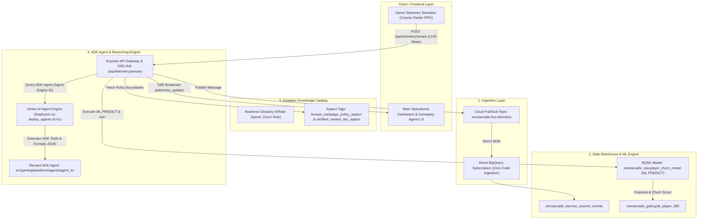

# Backend Implementation Plan: LiveOps Guardrail & Game Telemetry Simulator Flow

## Executive Overview

This plan details the backend architecture, service integrations, and data pipelines required to implement the live end-to-end flow from the **Game Telemetry Simulator** through **Google Cloud Platform (GCP)** to the **Gemini Enterprise-powered Player Retention Promo Agent**.



---

## 1. Reusable Infrastructure, Data Assets, & ADK Agent Callout Matrix

This backend implementation leverages existing infrastructure stood up by `src/retail-data-and-ai-demo` (Terraform/HCL), data assets created by `src/gamingdatademo` during the `./deploy-demo.sh` runbook, and the existing **ADK Agent** (`agent_kc`) in `src/gamingdatademo/agents/agent_kc`.

| Component / Asset | Source File / Deployment Step in `deploy-demo.sh` | Description & Reusability |
| :--- | :--- | :--- |
| **ADK Player Retention Promo Agent** | `src/gamingdatademo/agents/agent_kc` (`agent.py`) | **REUSABLE ADK AGENT**. Built with Google ADK (`google-adk`). Contains native FunctionTools (`verify_intervention_policy`, `get_glossary_term`, `verify_aspect_compliance`) and system instructions to format JSON decision payloads. Deployed to Vertex AI Agent Engine via `agents/deploy_agents.sh kc`. |
| **Telemetry Pub/Sub Topic** | `retail-data-and-ai-demo/.../games-pubsub.tf` (Step 1) | `google_pubsub_topic.live_telemetry` (`omniarcade-live-telemetry`). Used for real-time telemetry ingestion. |
| **Direct BigQuery Subscription** | `retail-data-and-ai-demo/.../games-pubsub.tf` (Step 1) | `google_pubsub_subscription.live_telemetry_bq_sub`. Automatically streams Pub/Sub messages into BigQuery with zero code. |
| **Raw Telemetry Table** | `retail-data-and-ai-demo/.../games-bigquery.tf` (Step 1) | `omniarcade_raw.live_session_events`. Stores raw incoming telemetry partitioned by day and clustered by `player_id`. |
| **Gold Player 360 Feature Store** | `gamingdatademo/dataform` & `games-bigquery.tf` (Steps 1 & 3) | `omniarcade_gold.gold_player_360`. Contains player monetization tier (`Whale`, `Dolphin`, `F2P`), LTV, and historical churn metrics. |
| **BQML Churn Prediction Model** | `games-bigquery-procedure.tf` & `deploy-demo.sh` (Step 5) | `omniarcade_raw.player_churn_model` trained via `CALL omniarcade_raw.train_churn_model()`. |
| **BQML ML.PREDICT Stored Procedure** | `games-bigquery-routines/calculate-churn-risk.sql.tftpl` | `omniarcade_raw.calculate_churn_risk(target_player_id)`. Computes real-time churn score by joining live telemetry with `gold_player_360`. |
| **Dataplex Aspect Tags** | `gamingdatademo/scripts/08_create_churn_guardrail_aspects.py` (Step 4) | Custom aspect types `liveops_campaign_policy_aspect` (Whale max 80% discount) & `certified_reward_sku_aspect` (`frost_giant_shield_pack`). |
| **Dataplex Business Glossary** | `gamingdatademo/scripts/01_create_glossary.py` (Step 4) | Governance glossary defining terms (*Whale Spend*, *Churn Risk*, *LTV*) accessible by Vertex AI Agent Engine. |
| **Cloud Run & API Gateway** | `server.ts` & `docs/deploy-demo.sh` (Step 7) | Express backend proxy hosting `/api/telemetry/stream`, SSE hub, and Dataplex/Vertex API proxies. |

---

## 2. ADK Agent Reuse & Integration Architecture

### Reused ADK Agent: `src/gamingdatademo/agents/agent_kc`

The codebase already includes an ADK agent written using Google Agent Development Kit (`google-adk`) located at `src/gamingdatademo/agents/agent_kc/agent.py`. This agent is specifically equipped for the Player Retention Promo Agent role.

#### Native ADK FunctionTools Available in `agent_kc`:
1. `verify_intervention_policy(player_id, payer_tier, requested_discount_pct)`:
   - Evaluates requested promotional discounts against Dataplex aspect boundaries:
     - `Whale`: Max 80% discount (`$0.99` for `$4.99` Frost Giant Shield Pack)
     - `Dolphin`: Max 50% discount
     - `F2P`: Max 25% discount
   - Returns structured decision (`APPROVED` vs. `REJECTED_EXCEEDS_DISCOUNT_CAP`).

2. `verify_aspect_compliance(target_resource, aspect_type)`:
   - Verifies compliance for `liveops_campaign_policy_aspect` and `certified_reward_sku_aspect` on `omniarcade_gold.gold_player_360`.

3. `get_glossary_term(term_id)`:
   - Queries Dataplex Business Glossary for terms like `whale-spend`, `realtime-churn-propensity`, and `autonomous-intervention-boundary`.

4. `search_entries`, `get_context`, `run_sql`:
   - Knowledge Catalog Context API discovery and BigQuery execution tools.

#### Decision Output Format:
`agent_kc` is instructed via system prompt to output a structured JSON payload for dynamic churn interventions:
```json
{
  "decision": "APPROVED",
  "player_id": "player_cosmic_whale_42",
  "payer_tier": "Whale",
  "churn_score": 0.87,
  "offer_payload": {
    "title": "$0.99 Frost Giant Shield Pack",
    "description": "Instant Resurrect + 24hr Frost Giant Shield Protection + 500 Gems",
    "discount_price": 0.99,
    "original_price": 4.99,
    "sku": "frost_giant_shield_pack"
  }
}
```

#### Deployment & Wiring:
- **Deployment Script**: Reuses `src/gamingdatademo/agents/deploy_agents.sh kc`, which executes `adk deploy agent_engine` to deploy `agent_kc` to Vertex AI Agent Engine.
- **Gateway Wiring**: Express server (`server.ts`) queries the deployed Reasoning Engine ID (`KC_AGENT_ID`) via `/api/chat` or `/api/guardrail/agent-trace`.

---

## 3. Detailed Implementation Phases

### Phase 1: Real-Time Telemetry Ingestion & Pub/Sub Pipeline
- **Goal**: Ingest telemetry events (e.g. `boss_fail`, `mission_quit`, `iap_attempt`) from the simulator into GCP in real time with <50ms ingestion latency.
- **Implementation Steps**:
  1. Use existing Pub/Sub topic `omniarcade-live-telemetry` (provisioned by `games-pubsub.tf`).
  2. Ensure zero-code direct BigQuery subscription (`omniarcade-live-telemetry-bq-sub`) is active and writing to `omniarcade_raw.live_session_events`.
  3. Update `server.ts` `/api/telemetry/stream` endpoint:
     - Formats incoming payload into strict JSON schema matching `games-bigquery-schema/live-session-events.json`.
     - Publishes payload to Pub/Sub via `@google-cloud/pubsub` SDK.
     - Returns `pubsub_message_id` and timestamp.

### Phase 2: In-Warehouse BQML Churn Prediction & Feature Store Lookup
- **Goal**: Execute real-time BQML inference to calculate player churn propensity when consecutive deaths or exit intent events occur.
- **Implementation Steps**:
  1. Query `omniarcade_raw.player_churn_model` using BigQuery `ML.PREDICT`:
     ```sql
     SELECT * FROM ML.PREDICT(
       MODEL `omniarcade_raw.player_churn_model`,
       (
         SELECT 
           @player_id AS player_id,
           @consecutive_deaths AS consecutive_deaths,
           @session_duration_seconds AS session_duration_seconds,
           @event_type AS event_type
       )
     )
     ```
  2. Join result with `omniarcade_gold.gold_player_360` to retrieve player monetization tier (`Whale`, `Dolphin`, `F2P`) and cumulative LTV.
  3. Classify churn risk level:
     - `churn_score >= 0.80`: **CRITICAL**
     - `churn_score >= 0.50`: **HIGH** (Triggers Dataplex Aspect Pre-Caching)
     - `churn_score < 0.50`: **LOW / MEDIUM**

### Phase 3: Dataplex Aspect Tag Verification & Offer Pre-Caching Engine
- **Goal**: Verify promotional discount boundaries against Dataplex governance aspects before an offer is presented to the player, executing in <300ms.
- **Implementation Steps**:
  1. Fetch `liveops_campaign_policy_aspect` and `certified_reward_sku_aspect` from Dataplex Knowledge Catalog REST API (`https://dataplex.googleapis.com/v1/...` or `@google-cloud/dataplex` SDK).
  2. Read max allowable discount by tier:
     - `Whale`: Max 80% discount (`$0.99` for `$4.99` Frost Giant Shield Pack)
     - `Dolphin`: Max 50% discount
     - `F2P`: Max 25% discount
  3. If BQML churn score >= 50%:
     - Pre-cache certified offer in `server.ts` in-memory LRU cache (`precachedOffers`).
     - Emit `policy_precached` event via SSE to the frontend.
  4. If BQML churn score >= 85%:
     - Execute guardrail offer and broadcast `churn_guardrail_triggered` event via SSE.

### Phase 4: Gemini Enterprise / ADK Agent Integration (`agent_kc`)
- **Goal**: Connect the Player Retention Promo Agent in `AgenticWorkflows.tsx` to the deployed ADK agent (`agent_kc`) on Vertex AI Agent Engine.
- **Implementation Steps**:
  1. Deploy `agent_kc` using `bash agents/deploy_agents.sh kc` and capture the resulting `KC_AGENT_ID`.
  2. Configure `process.env.VERTEX_AGENT_ENGINE_ID` in `server.ts` with `KC_AGENT_ID`.
  3. Implement `/api/chat` and `/api/guardrail/agent-trace` endpoints in `server.ts`:
     - Calls Vertex AI Agent Engine REST API (`reasoningEngines/:query`) using Application Default Credentials (ADC).
     - Streams reasoning trace steps (prompt building, BQML lookup, `verify_intervention_policy` tool call, Dataplex aspect check, JSON offer compilation).
  4. Handle single-invocation vs autonomous execution modes:
     - **Single-invocation**: Returns structured operational proposal for developer approval.
     - **Autonomous**: Automatically approves offer if `discount_pct <= max_allowed_discount` and logs evaluation in live proposal stream.

### Phase 5: GCP Resource Health & Diagnostics API
- **Goal**: Implement live health probes for all 5 GCP services displayed in `SimulatorDiagnostics.tsx`.
- **Implementation Steps**:
  1. Create `/api/diagnostics/gcp` endpoint in `server.ts`.
  2. Implement probe checks:
     - **Cloud Pub/Sub**: `pubsubClient.topic('omniarcade-live-telemetry').exists()`
     - **BigQuery Table**: `bigqueryClient.dataset('omniarcade_gold').table('gold_player_360').exists()`
     - **BQML Model**: Execute `SELECT * FROM omniarcade_raw.INFORMATION_SCHEMA.MODELS WHERE model_name='player_churn_model'`
     - **Dataplex Aspect**: Query Dataplex REST API for `liveops-campaign-policy-aspect`
     - **Vertex AI Agent**: Ping Vertex AI Reasoning Engine query endpoint for `KC_AGENT_ID`
  3. Return JSON response with status (`HEALTHY`, `DEGRADED`, `UNREACHABLE`), latency (ms), and active configuration details.

---

## 4. Integration Map: Fulfilling Frontend TODOs

This matrix maps every `// TODO:` comment placed during the frontend implementation to its corresponding backend API endpoint, GCP SDK call, and handler function.

| Frontend TODO Marker | Target File | Backend API Endpoint / GCP Integration | Implementation Details in `server.ts` |
| :--- | :--- | :--- | :--- |
| `// TODO: [Backend Integration] Wire up live gRPC / HTTP2 stream` | `simulatorBridge.ts` | `POST /api/telemetry/stream` | Publishes payload to Pub/Sub topic `omniarcade-live-telemetry` using `@google-cloud/pubsub`. |
| `// TODO: [Backend Integration - Trace API]` | `AgenticWorkflows.tsx` | `GET /api/guardrail/agent-trace` (SSE/WebSocket) | Streams step-by-step Gemini LLM reasoning steps from Vertex AI Reasoning Engine (`agent_kc`). |
| `// TODO: [Backend Integration - Prompt Context]` | `AgenticWorkflows.tsx` | `POST /api/chat` | Fetches live player profile & BQML score from BigQuery `gold_player_360` and queries `agent_kc`. |
| `// TODO: [Backend Probe] Pub/Sub` | `SimulatorDiagnostics.tsx` | `GET /api/diagnostics/gcp` -> `pubsub` | Calls `pubsubClient.topic('omniarcade-live-telemetry').exists()`. |
| `// TODO: [Backend Probe] BigQuery Table` | `SimulatorDiagnostics.tsx` | `GET /api/diagnostics/gcp` -> `bigquery` | Calls `bigqueryClient.dataset('omniarcade_gold').table('gold_player_360').exists()`. |
| `// TODO: [Backend Probe] BQML Model` | `SimulatorDiagnostics.tsx` | `GET /api/diagnostics/gcp` -> `bqml` | Executes `SELECT * FROM omniarcade_raw.INFORMATION_SCHEMA.MODELS WHERE model_name='player_churn_model'`. |
| `// TODO: [Backend Probe] Dataplex Aspect` | `SimulatorDiagnostics.tsx` | `GET /api/diagnostics/gcp` -> `dataplex` | Queries Dataplex REST API for `liveops-campaign-policy-aspect`. |
| `// TODO: [Backend Probe] Vertex AI Agent` | `SimulatorDiagnostics.tsx` | `GET /api/diagnostics/gcp` -> `vertex` | Pings Vertex AI Reasoning Engine query endpoint for `KC_AGENT_ID` (`agent_kc`). |

---

## 5. Verification & Deployment Runbook

1. **Deploy GCP Infrastructure & Assets**:
   - Run `docs/deploy-demo.sh --all` to provision Terraform resources, Dataform tables, Dataplex aspects, and train the BQML churn model.
2. **Deploy ADK Player Retention Promo Agent (`agent_kc`)**:
   - Run `bash src/gamingdatademo/agents/deploy_agents.sh kc` and capture the deployed `KC_AGENT_ID`.
3. **Verify Pub/Sub to BigQuery Direct Subscription**:
   - Publish a test message to `omniarcade-live-telemetry` and verify row insertion in `omniarcade_raw.live_session_events`.
4. **Verify BQML ML.PREDICT Inference**:
   - Execute `CALL omniarcade_raw.calculate_churn_risk('player_cosmic_whale_42')` in BigQuery console and verify churn score output.
5. **Verify Dataplex Aspect Registration & ADK Agent Tool Calls**:
   - Test `verify_intervention_policy` and `verify_aspect_compliance` tools on `agent_kc` via `adk playground` or `/api/chat`.
6. **Start Express Server in LIVE Mode**:
   - Start app: `npm run dev` or `node server.ts`.
   - Set top bar toggle to **LIVE (GCP)**.
   - Click "Fail Encounter" in simulator and verify:
     - Pub/Sub message published.
     - BQML score calculated.
     - SSE event `telemetry_update` received in dashboard.
     - Operational proposal generated via ADK `agent_kc` with Dataplex aspect compliance badge.
