# Architecture & Engineering Plan: BQML Predictive LTV Model Integration

## Executive Summary

This engineering plan details the end-to-end integration of a new **BigQuery ML Predictive LTV Model (`BOOSTED_TREE_REGRESSOR`)** into the OmniArcade Data & AI Operations Platform.

The new model predicts total future player Lifetime Value (LTV / `total_iap_spend`) using real-time feature vectors compiled in `gaming_gold.gold_player_360` (`consecutive_deaths`, `session_duration_seconds`, `days_since_last_login`, `payer_tier`, `favorite_category`).

This plan covers four core system integration areas:
1. **Target Architecture Infrastructure (Terraform & SQL Routines)** in [`src/retail-data-and-ai-demo`](file:///usr/local/google/home/joeholley/Documents/repos/git/github.com/joeholley/dcgd/src/retail-data-and-ai-demo).
2. **Master Deployment Orchestration Script** in [`deploy-demo.sh`](file:///usr/local/google/home/joeholley/Documents/repos/git/github.com/joeholley/dcgd/deploy-demo.sh).
3. **Operations Cloud Health Dashboard** in [`src/remix-gaming-app`](file:///usr/local/google/home/joeholley/Documents/repos/git/github.com/joeholley/dcgd/src/remix-gaming-app) and [`src/gamingdatademo/website-live`](file:///usr/local/google/home/joeholley/Documents/repos/git/github.com/joeholley/dcgd/src/gamingdatademo/website-live).
4. **Vertex AI Agent Reasoning Engine Access** for `agent_kc` in [`src/gamingdatademo/agents/agent_kc`](file:///usr/local/google/home/joeholley/Documents/repos/git/github.com/joeholley/dcgd/src/gamingdatademo/agents/agent_kc).

---

## High-Level Data & Control Architecture

```mermaid
sequenceDiagram
    autonumber
    actor Dev as Ops/Deployer
    participant Script as Master Deploy Script (deploy-demo.sh)
    participant BQ as BigQuery (gaming_gold)
    participant Health as Health Monitor (/api/system/gcp-health)
    participant UI as Operations Dashboard (GCPHealth.tsx)
    participant Agent as Gemini Enterprise Agent (agent_kc)

    rect rgb(20, 30, 50)
        note right of Script: Phase 1: Infrastructure & Automation
        Script->>BQ: Run Terraform / SQL Procedure (train_gaming_predictive_ltv_model)
        BQ->>BQ: CREATE OR REPLACE MODEL gaming_gold.gaming_predictive_ltv_model
    end

    rect rgb(25, 45, 30)
        note right of Health: Phase 2: Operations Cloud Health Dashboard
        UI->>Health: GET /api/system/gcp-health
        Health->>BQ: Execute ML.PREDICT probe against gaming_predictive_ltv_model
        BQ-->>Health: Returns status LIVE & latency ms
        Health-->>UI: Displays "BQML Predictive LTV Model" status card
    end

    rect rgb(45, 25, 50)
        note right of Agent: Phase 3: Agent KC Reasoning & Tool Access
        Agent->>BQ: search_entries / get_context (Dataplex catalog lookup)
        Agent->>BQ: run_sql ("SELECT * FROM ML.PREDICT(MODEL gaming_predictive_ltv_model, ...)")
        BQ-->>Agent: Returns predicted LTV $ value per player
    end
```



---

## Detailed Component Implementation Plan

### 1. Target Infrastructure & Stored Procedures (`src/retail-data-and-ai-demo`)

To align with the target architecture defined in `src/retail-data-and-ai-demo`, the BQML model training routine must be defined as a reusable Terraform-managed SQL routine.

#### Files to Create / Edit:
- **New Routine SQL File**: [`src/retail-data-and-ai-demo/infrastructure/terraform/games/games-bigquery-routines/train-predictive-ltv-model.sql.tftpl`](file:///usr/local/google/home/joeholley/Documents/repos/git/github.com/joeholley/dcgd/src/retail-data-and-ai-demo/infrastructure/terraform/games/games-bigquery-routines/train-predictive-ltv-model.sql.tftpl)
- **Terraform Procedure Definitions**: [`src/retail-data-and-ai-demo/infrastructure/terraform/games/games-bigquery-procedure.tf`](file:///usr/local/google/home/joeholley/Documents/repos/git/github.com/joeholley/dcgd/src/retail-data-and-ai-demo/infrastructure/terraform/games/games-bigquery-procedure.tf)

#### Step 1.1: Create Stored Procedure Template
Create `train-predictive-ltv-model.sql.tftpl`:
```sql
-- Procedure to train BQML Boosted Tree Regressor LTV Prediction Model
CREATE OR REPLACE MODEL `${gold_dataset_id}.gaming_predictive_ltv_model`
OPTIONS (
  MODEL_TYPE = 'BOOSTED_TREE_REGRESSOR',
  INPUT_LABEL_COLS = ['total_iap_spend']
) AS
SELECT
  payer_tier,
  days_since_last_login,
  consecutive_deaths,
  session_duration_seconds,
  favorite_category,
  total_iap_spend
FROM `${gold_dataset_id}.gold_player_360`
WHERE total_iap_spend IS NOT NULL;
```

#### Step 1.2: Add Terraform Routine Resource
In `games-bigquery-procedure.tf`, add the routine resource:
```hcl
resource "google_bigquery_routine" "train_gaming_predictive_ltv_model" {
  project      = local.bq_data_project_id
  dataset_id   = local.gold_dataset_id
  routine_id   = "train_gaming_predictive_ltv_model"
  routine_type = "PROCEDURE"
  language     = "SQL"

  definition_body = templatefile("${path.module}/games-bigquery-routines/train-predictive-ltv-model.sql.tftpl", {
    gold_dataset    = local.fq_gold_dataset_id
    gold_dataset_id = local.fq_gold_dataset_id
  })

  depends_on = [
    google_bigquery_dataset.gaming_gold
  ]
}
```

---

### 2. Master Deployment Script (`deploy-demo.sh`)

Update Step 5 of [`deploy-demo.sh`](file:///usr/local/google/home/joeholley/Documents/repos/git/github.com/joeholley/dcgd/deploy-demo.sh) to execute the training query for the new Predictive LTV model in addition to the existing churn prediction model.

#### File to Edit:
- [`deploy-demo.sh`](file:///usr/local/google/home/joeholley/Documents/repos/git/github.com/joeholley/dcgd/deploy-demo.sh) (Lines ~726-731)

#### Modification Details:
In `Step 5: In-Warehouse BQML Churn Model Training & Validation`, append the training execution:

```bash
  log_info "Training BQML Boosted Tree Regressor model 'gaming_gold.gaming_predictive_ltv_model'..."
  bq query --location="${GCP_REGION}" --use_legacy_sql=false "
    CREATE OR REPLACE MODEL \`${GCP_PROJECT}.gaming_gold.gaming_predictive_ltv_model\`
    OPTIONS (
      MODEL_TYPE = 'BOOSTED_TREE_REGRESSOR',
      INPUT_LABEL_COLS = ['total_iap_spend']
    ) AS
    SELECT
      payer_tier,
      days_since_last_login,
      consecutive_deaths,
      session_duration_seconds,
      favorite_category,
      total_iap_spend
    FROM \`${GCP_PROJECT}.gaming_gold.gold_player_360\`;
  "
  log_success "Step 5 Predictive LTV & Churn BQML models trained successfully."
```

---

### 3. Operations Cloud Health Dashboard Updates

To report real-time connectivity, latency, and operational health for the Predictive LTV model, both the backend diagnostic API and the React frontend dashboard need updates.

#### Files to Edit:
- Backend Probe Endpoint: [`src/remix-gaming-app/server.ts`](file:///usr/local/google/home/joeholley/Documents/repos/git/github.com/joeholley/dcgd/src/remix-gaming-app/server.ts)
- Dashboard UI Component: [`src/remix-gaming-app/src/components/sections/GCPHealth.tsx`](file:///usr/local/google/home/joeholley/Documents/repos/git/github.com/joeholley/dcgd/src/remix-gaming-app/src/components/sections/GCPHealth.tsx)
- Auxiliary Python Health Endpoint: [`src/gamingdatademo/website-live/app.py`](file:///usr/local/google/home/joeholley/Documents/repos/git/github.com/joeholley/dcgd/src/gamingdatademo/website-live/app.py) & [`src/gamingdatademo/website-live/static/health.html`](file:///usr/local/google/home/joeholley/Documents/repos/git/github.com/joeholley/dcgd/src/gamingdatademo/website-live/static/health.html)

#### Step 3.1: Add Backend Probe in `server.ts`
1. Define constant `BQML_LTV_MODEL_NAME = "gaming_gold.gaming_predictive_ltv_model"`.
2. Add `testBQMLLTV` probe to `/api/system/gcp-health`:
```typescript
const testBQMLLTV = async () => {
  const start = Date.now();
  return withTimeout(
    (async () => {
      const bqRows = await executeCustomQuery(
        `SELECT * FROM ML.PREDICT(MODEL \`${PROJECT_ID}.${BQML_LTV_MODEL_NAME}\`, (SELECT 'Whale' AS payer_tier, 5 AS days_since_last_login, 2 AS consecutive_deaths, 600 AS session_duration_seconds, 'RPG' AS favorite_category))`
      );
      if (bqRows && bqRows.length > 0) {
        return { status: "LIVE" as const, details: `BQML LTV model '${BQML_LTV_MODEL_NAME}' online`, latency_ms: Date.now() - start };
      }
      return { status: "MOCK" as const, details: "BQML LTV model probe empty; using fallback regression estimator", latency_ms: Date.now() - start };
    })(),
    2000,
    { status: "MOCK" as const, details: "BQML LTV model probe timed out (2s); using fallback regression estimator", latency_ms: 2000 }
  );
};
```
3. Include `bqml_ltv` in response JSON payload returned to the UI.

#### Step 3.2: Update `GCPHealth.tsx` Component
1. Extend `GCPHealthResponse` interface to include `bqml_ltv`:
```typescript
interface GCPHealthResponse {
  // ...
  services: {
    // ...
    bqml: ServiceHealth;
    bqml_ltv: ServiceHealth;
    // ...
  };
}
```
2. Add service card entry to `serviceConfigs` array:
```typescript
{
  key: "bqml_ltv" as const,
  name: "BQML Predictive LTV Model",
  description: "In-warehouse ML.PREDICT boosted tree regressor (gaming_gold.gaming_predictive_ltv_model)",
  icon: BrainCircuit,
}
```

---

### 4. Vertex AI Agent (`agent_kc`) Modifications

Provide `agent_kc` with full prompt guidance, schema context, and catalog entries for predicting player LTV using BigQuery ML.

#### Files to Edit:
- Root Agent Definition: [`src/gamingdatademo/agents/agent_kc/agent.py`](file:///usr/local/google/home/joeholley/Documents/repos/git/github.com/joeholley/dcgd/src/gamingdatademo/agents/agent_kc/agent.py)
- App Module Agent Definition: [`src/gamingdatademo/agents/agent_kc/app/agent.py`](file:///usr/local/google/home/joeholley/Documents/repos/git/github.com/joeholley/dcgd/src/gamingdatademo/agents/agent_kc/app/agent.py)
- Dataplex Glossary / Aspect Scripts: [`src/gamingdatademo/scripts/01_create_glossary.py`](file:///usr/local/google/home/joeholley/Documents/repos/git/github.com/joeholley/dcgd/src/gamingdatademo/scripts/01_create_glossary.py) & [`src/gamingdatademo/scripts/08_create_churn_guardrail_aspects.py`](file:///usr/local/google/home/joeholley/Documents/repos/git/github.com/joeholley/dcgd/src/gamingdatademo/scripts/08_create_churn_guardrail_aspects.py)

#### Step 4.1: Update `SYSTEM_INSTRUCTION` in `agent.py` & `app/agent.py`
Add explicit documentation on available BQML predictive models to the agent's system prompt:

```markdown
## In-Warehouse BigQuery ML Models:
- **Churn Propensity Model (`gaming_raw.gaming_player_churn_model`)**: Logistic regression model predicting player churn probability (0.0 to 1.0).
- **Predictive LTV Model (`gaming_gold.gaming_predictive_ltv_model`)**: Boosted tree regressor predicting total future player LTV (`total_iap_spend`) based on player feature vectors (`payer_tier`, `days_since_last_login`, `consecutive_deaths`, `session_duration_seconds`, `favorite_category`).

## Querying BigQuery ML Models:
When asked to forecast player value, future revenue, or lifetime value (LTV):
1. Execute `run_sql` with `ML.PREDICT`:
```sql
SELECT
  p.player_id,
  p.payer_tier,
  p.total_iap_spend AS current_ltv,
  ROUND(m.predicted_total_iap_spend, 2) AS predicted_future_ltv
FROM `${PROJECT_ID}.gaming_gold.gold_player_360` p
CROSS JOIN UNNEST(
  ML.PREDICT(
    MODEL `${PROJECT_ID}.gaming_gold.gaming_predictive_ltv_model`,
    (
      SELECT
        payer_tier,
        days_since_last_login,
        consecutive_deaths,
        session_duration_seconds,
        favorite_category,
        total_iap_spend
      FROM `${PROJECT_ID}.gaming_gold.gold_player_360`
      WHERE player_id = p.player_id
    )
  )
) m;
```
2. Synthesize results to highlight top potential spenders or at-risk high-value players.
```

#### Step 4.2: Register Dataplex Business Glossary & Aspect Tags for Discovery
Update Dataplex scripts in `src/gamingdatademo/scripts/`:
1. Register glossary term `predictive-ltv-model` in `01_create_glossary.py` with definition:
   *"In-warehouse BQML Boosted Tree Regressor model estimating total player lifetime value based on activity, death rate, and spend history."*
2. Bind aspect tag metadata to `gaming_gold.gaming_predictive_ltv_model` in Dataplex Knowledge Catalog so `search_entries("predictive ltv")` returns full context.

---

## Plan Verification & Validation Steps

After implementing the code changes according to this plan, execute the following validation steps:

1. **Verify Infrastructure & Stored Procedure Compilation**:
   ```bash
   ./deploy-demo.sh --steps 1,5
   ```
   *Expected Outcome*: BigQuery dataset `gaming_gold` contains routine `train_gaming_predictive_ltv_model` and model `gaming_predictive_ltv_model`.

2. **Verify Model Training Execution via BQ CLI**:
   ```bash
   bq query --use_legacy_sql=false "SELECT * FROM ML.EVALUATE(MODEL \`gaming_gold.gaming_predictive_ltv_model\`)"
   ```
   *Expected Outcome*: Evaluation metrics (mean_absolute_error, mean_squared_error, r2_score) returned successfully.

3. **Verify Dashboard Health Endpoint**:
   ```bash
   curl -s http://localhost:3000/api/system/gcp-health | jq '.services.bqml_ltv'
   ```
   *Expected Outcome*: Response status `LIVE` with probe latency < 500ms.

4. **Verify `agent_kc` Agent Engine Inference**:
   Run interactive agent cli playground or send test prompt:
   ```bash
   agents-cli playground
   # Prompt: "Predict the future LTV for our top 5 players using the predictive LTV BQML model"
   ```
   *Expected Outcome*: `agent_kc` executes `search_entries` or `run_sql` targeting `gaming_gold.gaming_predictive_ltv_model` and returns structured player LTV predictions.

---

## Summary Table of Files Included in Implementation

| Component | Target File | Action Required |
| :--- | :--- | :--- |
| **Terraform SQL Routine** | [`src/retail-data-and-ai-demo/infrastructure/terraform/games/games-bigquery-routines/train-predictive-ltv-model.sql.tftpl`](file:///usr/local/google/home/joeholley/Documents/repos/git/github.com/joeholley/dcgd/src/retail-data-and-ai-demo/infrastructure/terraform/games/games-bigquery-routines/train-predictive-ltv-model.sql.tftpl) | Create SQL template |
| **Terraform Routine Declaration** | [`src/retail-data-and-ai-demo/infrastructure/terraform/games/games-bigquery-procedure.tf`](file:///usr/local/google/home/joeholley/Documents/repos/git/github.com/joeholley/dcgd/src/retail-data-and-ai-demo/infrastructure/terraform/games/games-bigquery-procedure.tf) | Add routine resource |
| **Deploy Orchestrator** | [`deploy-demo.sh`](file:///usr/local/google/home/joeholley/Documents/repos/git/github.com/joeholley/dcgd/deploy-demo.sh) | Add Step 5 training query |
| **Express Health API** | [`src/remix-gaming-app/server.ts`](file:///usr/local/google/home/joeholley/Documents/repos/git/github.com/joeholley/dcgd/src/remix-gaming-app/server.ts) | Add `testBQMLLTV` probe |
| **Operations Dashboard UI** | [`src/remix-gaming-app/src/components/sections/GCPHealth.tsx`](file:///usr/local/google/home/joeholley/Documents/repos/git/github.com/joeholley/dcgd/src/remix-gaming-app/src/components/sections/GCPHealth.tsx) | Add `bqml_ltv` UI status card |
| **Agent Prompt & Logic** | [`src/gamingdatademo/agents/agent_kc/agent.py`](file:///usr/local/google/home/joeholley/Documents/repos/git/github.com/joeholley/dcgd/src/gamingdatademo/agents/agent_kc/agent.py) | Update prompt with model SQL guidance |
| **Agent Prompt & Logic** | [`src/gamingdatademo/agents/agent_kc/app/agent.py`](file:///usr/local/google/home/joeholley/Documents/repos/git/github.com/joeholley/dcgd/src/gamingdatademo/agents/agent_kc/app/agent.py) | Update prompt with model SQL guidance |
| **Dataplex Glossaries** | [`src/gamingdatademo/scripts/01_create_glossary.py`](file:///usr/local/google/home/joeholley/Documents/repos/git/github.com/joeholley/dcgd/src/gamingdatademo/scripts/01_create_glossary.py) | Add glossary term for discovery |
