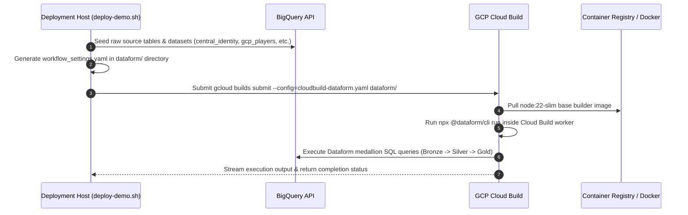

# Technical & Architecture Plan: Offloading Dataform Pipeline Execution to Cloud Build

## Executive Summary
This document provides the architectural plan for refactoring **Step 3 (Dataform Medallion Pipeline Execution)** of the master deployment script (`deploy-demo.sh`). Currently, Step 3 requires local installation of Node.js and executes `@dataform/cli` directly on the host machine. 

This refactor replaces local execution with a containerized Cloud Build job (`gcloud builds submit`), which spins up a standard Node container in GCP, installs or runs `@dataform/cli`, and executes the Bronze $\to$ Silver $\to$ Gold BigQuery medallion compilation and execution within Google Cloud infrastructure.

---

## 1. Goals & Benefits

1. **Host Independence**: Eliminates the local Node.js / `npm` / `npx` pre-flight requirement for running deployment scripts.
2. **Standardized Execution Environment**: Runs Dataform inside a controlled containerized environment (`node:22-slim`) on Cloud Build, eliminating local OS version or package manager differences.
3. **Cloud Native Logging & Tracing**: Logs pipeline build steps directly in Cloud Logging and streams logs to the console terminal via `gcloud builds submit`.
4. **IAM Security Isolation**: Runs queries under the Cloud Build Service Account with explicit BigQuery Data Editor / Job User permissions.

---

## 2. Architecture & Execution Sequence



---

## 3. High-Level Changes Overview

### A. New File: Cloud Build Dataform Pipeline Spec
* **Path**: `src/gamingdatademo/cloudbuild-dataform.yaml`
* **Contents**:
```yaml
# Copyright 2026 Google LLC
# Cloud Build pipeline specification for running Dataform Medallion Models

substitutions:
  _LOCATION: 'us-central1'
  _PROJECT_ID: ''

options:
  logging: CLOUD_LOGGING_ONLY

steps:
  # Step 1: Run Dataform medallion pipeline using Node container
  - id: 'execute-dataform'
    name: 'node:22-slim'
    entrypoint: 'bash'
    args:
      - '-c'
      - |
        set -euo pipefail
        echo "=== Dataform Container Runner ==="
        echo "Project ID: ${_PROJECT_ID}"
        echo "Location: ${_LOCATION}"
        
        # Install and execute Dataform CLI
        npx --yes @dataform/cli run . \
          --default-location="${_LOCATION}" \
          --vars=project_id:${_PROJECT_ID},industry:games
```

### B. Modifications to Master Orchestrator (`deploy-demo.sh`)

1. **Step 0 Pre-Flight Adjustment**:
   - Remove strict pre-flight failure for missing local `node` / `npm` when running Step 3, or mark `node` check as optional/informational since Cloud Build handles execution.

2. **Step 3 Execution Refactor**:
   - Retain table seeding (`central_identity`, `gcp_players`, `live_session_events`, `iap_transactions`) via `bq query`.
   - Grant necessary IAM permissions to the Cloud Build Service Account (`${GCP_PROJECT_NUMBER}@cloudbuild.gserviceaccount.com`):
     - `roles/bigquery.dataEditor`
     - `roles/bigquery.jobUser`
   - Generate `workflow_settings.yaml` dynamically.
   - Replace local `dataform run` / `npx @dataform/cli run` logic with:
     ```bash
     log_info "Submitting Dataform pipeline execution job to Cloud Build..."
     gcloud builds submit \
       --config="${GAMING_DIR}/cloudbuild-dataform.yaml" \
       --substitutions=_PROJECT_ID="${GCP_PROJECT}",_LOCATION="${GCP_REGION}" \
       --project="${GCP_PROJECT}" \
       "${DATAFORM_DIR}"
     ```

---

## 4. Implementation Step-by-Step Task List

### Task 1: Create `cloudbuild-dataform.yaml`
- Create `src/gamingdatademo/cloudbuild-dataform.yaml`.
- Define parameters `_PROJECT_ID` and `_LOCATION`.
- Set step to run `npx --yes @dataform/cli run .` inside `node:22-slim`.

### Task 2: Update IAM Roles in `deploy-demo.sh`
- Ensure Cloud Build Service Account has permissions to execute BigQuery jobs and write tables:
  - `grant_role_silently "serviceAccount:${GCP_PROJECT_NUMBER}@cloudbuild.gserviceaccount.com" "roles/bigquery.dataEditor"`
  - `grant_role_silently "serviceAccount:${GCP_PROJECT_NUMBER}@cloudbuild.gserviceaccount.com" "roles/bigquery.jobUser"`

### Task 3: Refactor Step 3 in `deploy-demo.sh`
- Replace local `dataform` / `npx` invocation block with `gcloud builds submit` call targeting `cloudbuild-dataform.yaml`.

### Task 4: Update Pre-Flight Checks in Step 0
- Update Step 0 tool checks so local missing `node`/`npm` no longer blocks deployment when executing Step 3 via Cloud Build.

---

## 5. Verification & Acceptance Plan

1. **Cloud Build Execution Test**: Execute `./deploy-demo.sh --steps 3` on a environment without local Node installed.
2. **Log Verification**: Confirm build logs stream to terminal from Cloud Build and indicate `execute-dataform` step success.
3. **BigQuery Table Verification**: Verify dataset tables (`gaming_gold.gold_player_360`, `gold_regional_kpis`, `gold_campaign_analytics`) are updated and populated correctly by the containerized build job.
