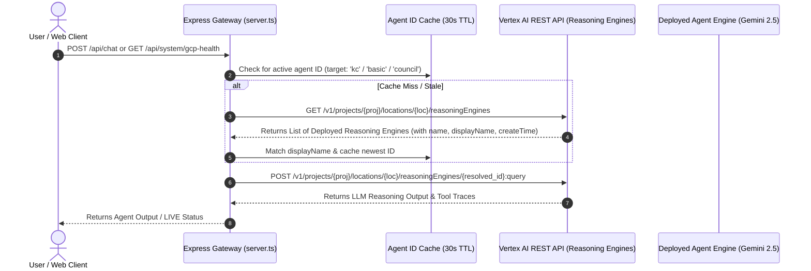

# Technical Plan: Dynamic Agent Engine Discovery (Gemini Enterprise Agent Runtime)

## Executive Overview & Goal

Currently, the Express web gateway ([`src/remix-gaming-app/server.ts`](file:///usr/local/google/home/joeholley/Documents/repos/git/github.com/joeholley/dcgd/src/remix-gaming-app/server.ts)) requires explicit numeric Reasoning Engine IDs (e.g., `process.env.VERTEX_AGENT_ENGINE_ID="84930219482910"`). If the environment variable is unconfigured or stale, health probes and API endpoints fail over to local mock responses.

This plan details a **dynamic agent discovery mechanism** that queries the Vertex AI Reasoning Engine REST API (`/v1/projects/.../locations/.../reasoningEngines`) at runtime. The application will automatically discover, cache, and route requests to deployed agents based on their `displayName` (e.g., `"OmniArcade KC Agent"`, `"OmniArcade Basic Agent"`) without requiring hardcoded IDs or manual configuration.

---

## Architecture & Discovery Sequence



---

## Detailed Implementation Steps

### Phase 1: Reasoning Engine Discovery Service in `server.ts`
**File**: [`src/remix-gaming-app/server.ts`](file:///usr/local/google/home/joeholley/Documents/repos/git/github.com/joeholley/dcgd/src/remix-gaming-app/server.ts)

1. **Define Agent Resolution Interface & Cache**:
   - Create an in-memory cache (`Map<string, { id: string, displayName: string, timestamp: number }>`) with a 30-second TTL.
   - Support target agent aliases:
     - `'kc'` / `'default'` $\to$ Matches `displayName` containing `"KC"`, `"Knowledge Catalog"`, or `"OmniArcade"` (prefers newest).
     - `'basic'` $\to$ Matches `displayName` containing `"Basic"`.
     - `'scaled'` $\to$ Matches `displayName` containing `"Scaled"`.
     - `'council'` / `'swarm'` $\to$ Matches `displayName` containing `"Council"` or `"Swarm"`.

2. **Implement `discoverReasoningEngines()` Helper**:
   ```typescript
   async function discoverReasoningEngines(): Promise<Array<{ id: string, displayName: string, name: string, createTime: string }>> {
     const client = await auth.getClient().catch(() => null);
     const tokenRes = client ? await client.getAccessToken().catch(() => null) : null;
     const accessToken = typeof tokenRes === 'string' ? tokenRes : tokenRes?.token;
     if (!accessToken) return [];

     const url = `https://${LOCATION}-aiplatform.googleapis.com/v1/projects/${PROJECT_ID}/locations/${LOCATION}/reasoningEngines`;
     const res = await fetch(url, { headers: { Authorization: `Bearer ${accessToken}` } }).catch(() => null);
     if (!res || !res.ok) return [];

     const data = await res.json();
     const engines = data.reasoningEngines || [];
     return engines.map((e: any) => ({
       id: e.name.split("/").pop(),
       displayName: e.displayName || "",
       name: e.name,
       createTime: e.createTime || "",
     })).sort((a: any, b: any) => new Date(b.createTime).getTime() - new Date(a.createTime).getTime());
   }
   ```

3. **Implement `getAgentEngineId(targetRole)`**:
   - Check environment variable override (`VERTEX_AGENT_ENGINE_ID` / `KC_AGENT_ID`).
   - If missing, call `discoverReasoningEngines()` and return the ID of the newest matching agent.

---

### Phase 2: Refactor API Endpoints to Use Dynamic Resolution

1. **`/api/system/gcp-health` & Health Probes**:
   - Update `testVertexAgent()` to use `getAgentEngineId('kc')`.
   - If an agent is found on GCP, probe reports:
     `status: "LIVE"`, `details: "Gemini Enterprise Agent Runtime 'OmniArcade KC Agent' (ID: 849302194829) online"`.

2. **`/api/chat` (AI Assistant Endpoint)**:
   - Dynamically resolve agent ID via `getAgentEngineId('kc')` or `req.body.agent_type`.
   - Issue `:query` or `:streamQuery` to the discovered Reasoning Engine.

3. **`/api/guardrail/agent-trace` (LiveOps Guardrail Endpoint)**:
   - Include resolved agent ID and display name in trace step details.

---

### Phase 3: Validation & Verification

| Test Case | Scenario | Expected Result |
|-----------|----------|-----------------|
| **1. No Environment Variable Set** | Run server without `VERTEX_AGENT_ENGINE_ID` | Server queries Vertex AI API, discovers `"OmniArcade KC Agent"`, and uses its numeric ID automatically. |
| **2. Explicit Env Var Override** | Set `VERTEX_AGENT_ENGINE_ID=12345` | Server respects explicit override over dynamic discovery. |
| **3. Fresh Agent Deployment** | Deploy new agent via `deploy_agents.sh` | Within 30s (cache TTL), server automatically switches to the newly deployed agent. |
| **4. Zero Deployed Agents** | Query project with 0 agents | Server gracefully falls back to local assistant with clear diagnostic detail. |

---

## Next Steps & Execution

Would you like me to proceed with implementing this dynamic discovery service in `server.ts` and verifying the build?
