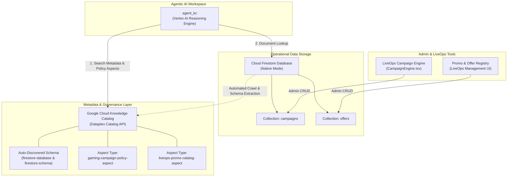
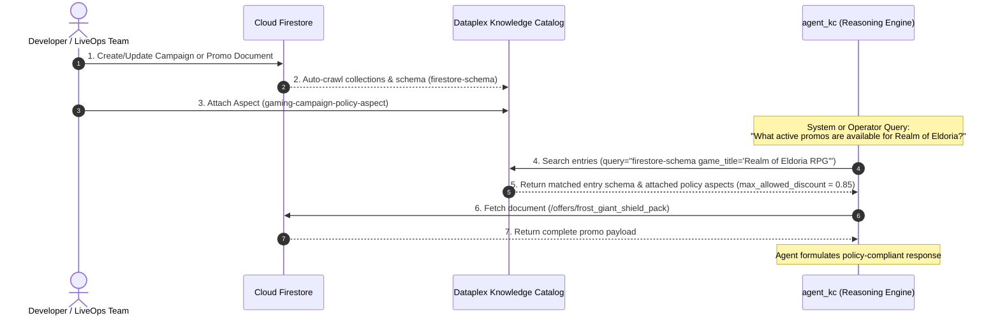
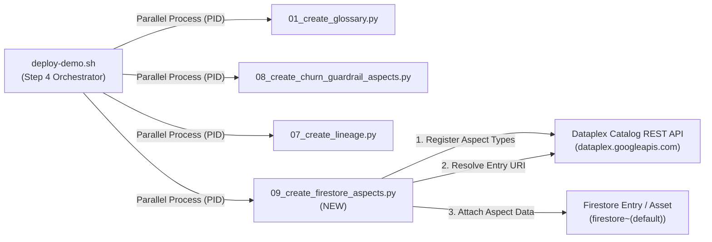

# Architecture & Implementation Plan: Firestore Campaign & Offer Storage with Knowledge Catalog Enrichment

## 1. Executive Summary & Scope

### 1.1 Objective
This document outlines the architecture and implementation plan for storing game campaigns, promotional packages, and live in-game offers in **Cloud Firestore**, enriched with **Google Cloud Knowledge Catalog (formerly Dataplex Knowledge Catalog)**. 

By centralizing campaign and offer storage in Firestore and cataloging their technical and business metadata in Knowledge Catalog:
- Game developers and LiveOps operators gain a centralized, schema-structured repository for creating, auditing, and maintaining marketing campaigns and in-game promos.
- Autonomous backend agents (such as `agent_kc`, the Knowledge Catalog Analytics Agent) and backend decision engines can dynamically search, inspect, and extract active promo configurations and policy aspect tags via the Dataplex REST API and Firestore SDK without hardcoding configuration state.

### 1.2 Boundary & Out-of-Scope Definition
> [!IMPORTANT]
> **Out-of-Scope for this implementation:**
> - Player eligibility evaluation logic, churn score thresholding, and personalized offer pop-up approval gates for end users.
> - Client-side offer redemption, player inventory crediting, and real-time SSE client stream handling.
>
> **In-Scope for this implementation:**
> - Administrative storage of campaigns and offers in Cloud Firestore collections (`campaigns` and `offers`).
> - Automatic schema discovery and custom **Aspect Type** tagging in Dataplex Knowledge Catalog.
> - API interface for `agent_kc` to discover active promos, budget caps, and policy aspects.

---

## 2. Ingested Technical Architecture & Integration Pattern



### 2.1 Cloud Firestore Integration
Cloud Firestore (in Native Mode) serves as the primary operational document store for active campaigns and promos. It provides:
- **Real-time Synchronization & Latency**: Low-latency queries for backend agent decision engines.
- **Document Structure**: Hierarchical and typed document storage matching existing TypeScript interfaces in `src/remix-gaming-app`.
- **Granular IAM Control**: Role-based access for LiveOps operators and service accounts.

### 2.2 Dataplex Knowledge Catalog Integration
Knowledge Catalog automatically harvests technical metadata from Cloud Firestore databases:
1. **Resource Metadata**: Project ID, database ID (`(default)`), edition, region, mode, and creation timestamps.
2. **Schema Discovery**: Collection definitions (`campaigns`, `offers`), document fields, and data types mapped to catalog asset entries (`firestore-database`, `firestore-schema`).
3. **Custom Aspect Enrichment**: Business attributes (e.g., maximum allowed discount percentages, authorized game studios, target cohort classifications) attached as **Aspects** instantiated from custom **Aspect Types**.

### 2.3 `agent_kc` Catalog Access Pattern
When `agent_kc` processes reasoning queries (e.g., *"What active promos exist for high-value players in Realm of Eldoria RPG?"* or *"What is the maximum allowed discount percentage for VIP whale offers?"*):
1. **Catalog Search**: Executes `searchEntries` against Dataplex Knowledge Catalog (`entryGroups/@default/entries:search`) querying tagged Firestore schemas and `gaming-campaign-policy-aspect` metadata.
2. **Aspect Policy Inspection**: Reads aspect parameters (`max_allowed_discount = 0.85`) to verify governance boundaries.
3. **Document Retrieval**: Performs targeted queries against the `campaigns` and `offers` Firestore collections to retrieve the specific active promo configurations.

---

## 3. Storage Data Schema Design

The schema is built upon the existing offer and campaign models in `CampaignEngine.tsx`, `LiveOpsGuardrail.tsx`, and `server.ts`.

### 3.1 Collection: `campaigns`
Path: `/campaigns/{campaign_id}`

Stores marketing campaigns created by LiveOps managers and marketing teams.

```json
{
  "id": "cmp_eldoria_dormant_2026_01",
  "name": "Realm of Eldoria Dormant Cohort Recovery",
  "game_title": "Realm of Eldoria RPG",
  "cohort_target": "Realm of Eldoria Dormant Cohort",
  "propensity_score": 88,
  "original_budget_usd": 50000.00,
  "ai_adjusted_budget_usd": 65000.00,
  "is_ai_adjusted": true,
  "marketing_messages": {
    "en": "Ready to conquer the stars again, Commander? A rare Legendary Obsidian Blade is waiting in your gift crate!",
    "ja": "星々を再び征服する準備はできていますか、司令官？伝説のオブシディアンブレードが待っています！",
    "ko": "다시 별을 정복할 준비가 되셨나요, 사령관님? 전설적인 옵시디언 블레이드가 선물이 준비되어 있습니다!",
    "zh": "准备好再次征服星辰了吗，指挥官？罕见的传奇黑曜石之刃在您的礼物箱中等待着您！"
  },
  "distribution_channels": [
    "In-Game Pop-up",
    "Push Notification",
    "Email"
  ],
  "status": "Active",
  "policy_aspect_ref": "projects/omniarcade-demo/locations/us-central1/aspectTypes/gaming-campaign-policy-aspect",
  "created_at": "2026-07-01T10:00:00Z",
  "updated_at": "2026-07-16T09:00:00Z",
  "created_by": "liveops_lead@omniarcade.com"
}
```

#### Field Specifications

| Field Name | Type | Description |
| :--- | :--- | :--- |
| `id` | `string` | Unique document ID (`cmp_<identifier>`). |
| `name` | `string` | Human-readable title of the campaign. |
| `game_title` | `string` | Target game title associated with the campaign. |
| `cohort_target` | `string` | Designated player segment/cohort (e.g., *"Retro Speed Racer Churn-Risk"*). |
| `propensity_score` | `number` | Minimum propensity/churn score trigger threshold (0 to 100). |
| `original_budget_usd` | `number` | Initial marketing allocation in USD. |
| `ai_adjusted_budget_usd` | `number` | Dynamic budget adjusted by automated agent optimizations. |
| `is_ai_adjusted` | `boolean` | Flag indicating whether AI budget optimization has been applied. |
| `marketing_messages` | `map<string, string>` | Multi-lingual marketing messages keyed by ISO language code. |
| `distribution_channels` | `array<string>` | Active communication channels for promo distribution. |
| `status` | `string (enum)` | State: `"Draft"`, `"Pending"`, `"Active"`, or `"Archived"`. |
| `policy_aspect_ref` | `string` | Resource URI to the governing Dataplex Aspect Type. |
| `created_at` | `timestamp` | UTC ISO creation timestamp. |
| `updated_at` | `timestamp` | UTC ISO modification timestamp. |
| `created_by` | `string` | Creator identity/email. |

---

### 3.2 Collection: `offers`
Path: `/offers/{offer_sku}`

Stores in-game promotional packages and item bundles offered by developers and LiveOps teams.

```json
{
  "sku": "frost_giant_shield_pack",
  "title": "Frost Giant Shield Pack",
  "description": "Instant Resurrect + 24hr Frost Giant Shield Protection for Realm of Eldoria boss battles.",
  "game_title": "Realm of Eldoria RPG",
  "category": "Consumable Bundles",
  "base_price_usd": 4.99,
  "cohort_discounts": {
    "Whale": 80,
    "Dolphin": 60,
    "Minnow": 40,
    "F2P": 25
  },
  "max_allowed_discount": 0.85,
  "inclusions": [
    { "item_id": "item_resurrect_scroll", "quantity": 1, "display_name": "Instant Resurrect Scroll" },
    { "item_id": "item_frost_shield_24h", "quantity": 1, "display_name": "Frost Giant Shield (24 Hours)" }
  ],
  "governance": {
    "certified_by": "dataplex_policy_aspect",
    "policy_aspect_id": "gaming-campaign-policy-aspect",
    "policy_status": "APPROVED"
  },
  "status": "ACTIVE",
  "valid_from": "2026-07-01T00:00:00Z",
  "valid_until": "2026-12-31T23:59:59Z",
  "created_at": "2026-07-01T12:00:00Z",
  "updated_at": "2026-07-16T08:30:00Z"
}
```

#### Field Specifications

| Field Name | Type | Description |
| :--- | :--- | :--- |
| `sku` | `string` | Unique SKU ID (`frost_giant_shield_pack`). |
| `title` | `string` | Promotional package display title. |
| `description` | `string` | Package details and item inclusions. |
| `game_title` | `string` | Associated game title. |
| `category` | `string` | Content category (e.g., *"Skins & Cosmetics"*, *"Consumable Bundles"*). |
| `base_price_usd` | `number` | Full retail base price in USD ($4.99). Promotional prices are calculated dynamically at offer time using `base_price_usd * (1 - discount_pct / 100)`. |
| `cohort_discounts` | `map<string, number>` | Discount percentage integers mapped per pre-defined cohort tier (`Whale: 80`, `Dolphin: 60`, `Minnow: 40`, `F2P: 25`). |
| `max_allowed_discount` | `number` | Maximum policy discount ceiling ratio across all cohorts (e.g. `0.85` = 85%). |
| `inclusions` | `array<map>` | List of in-game items included in the promo pack. |
| `governance` | `map` | Certification details (`certified_by`, `policy_aspect_id`, `policy_status`). |
| `status` | `string (enum)` | Availability state: `"ACTIVE"`, `"PAUSED"`, or `"EXPIRED"`. |
| `valid_from` | `timestamp` | Start timestamp of promo availability. |
| `valid_until` | `timestamp` | Expiration timestamp of promo availability. |
| `created_at` | `timestamp` | UTC ISO creation timestamp. |
| `updated_at` | `timestamp` | UTC ISO modification timestamp. |

---

## 4. Knowledge Catalog Aspect Enrichment Specification

To enable Dataplex Knowledge Catalog discovery, custom **Aspect Types** will be defined and associated with the Firestore database entries.

### 4.1 Aspect Type Definition: `gaming-campaign-policy-aspect`
This aspect enforces business rule constraints and compliance governance across campaigns and offers.

```json
{
  "name": "projects/omniarcade-demo/locations/us-central1/aspectTypes/gaming-campaign-policy-aspect",
  "displayName": "Gaming LiveOps Campaign Policy Aspect",
  "description": "Governance policy aspect enforcing maximum discount limits and studio authorizations for promos.",
  "fields": [
    {
      "name": "max_allowed_discount",
      "displayName": "Max Allowed Discount Ratio",
      "type": "DOUBLE",
      "description": "Upper discount threshold limit (e.g. 0.85 for 85%)."
    },
    {
      "name": "authorized_studios",
      "displayName": "Authorized Game Studios",
      "type": "ARRAY",
      "description": "List of studio titles permitted to issue this promo."
    },
    {
      "name": "compliance_status",
      "displayName": "Policy Compliance Status",
      "type": "STRING",
      "description": "Status code: APPROVED, PENDING_REVIEW, EXEMPT."
    },
    {
      "name": "governance_owner",
      "displayName": "Governance Owner Team",
      "type": "STRING",
      "description": "Responsible compliance group (e.g., 'LiveOps Operations Governance')."
    }
  ]
}
```

### 4.2 Aspect Type Definition: `liveops-promo-catalog-aspect`
Provides search taxonomy attributes for catalog navigation.

```json
{
  "name": "projects/omniarcade-demo/locations/us-central1/aspectTypes/liveops-promo-catalog-aspect",
  "displayName": "LiveOps Promo Catalog Taxonomy Aspect",
  "description": "Categorization metadata for indexing promos and campaigns in Dataplex Knowledge Catalog.",
  "fields": [
    {
      "name": "revenue_category",
      "displayName": "Revenue Category",
      "type": "STRING",
      "description": "Category tag (e.g., 'Monetization Recovery', 'Re-engagement')."
    },
    {
      "name": "target_cohort_class",
      "displayName": "Target Cohort Class",
      "type": "STRING",
      "description": "Player class targeted ('High LTV Churn Risk', 'Dormant VIP')."
    }
  ]
}
```

---

## 5. `agent_kc` Discovery & Access Protocol

`agent_kc` (Knowledge Catalog Analytics Agent) interacts with the promo storage through a two-phase protocol:



### 5.1 Discovery Step Details
1. **Catalog Search Call**:
   ```http
   GET https://dataplex.googleapis.com/v1/projects/omniarcade-demo/locations/us-central1/entryGroups/@default/entries:search?query=type=firestore-schema AND aspect:gaming-campaign-policy-aspect
   Authorization: Bearer <ADC_TOKEN>
   ```
2. **Result Parsing**:
   `agent_kc` reads the catalog entry annotations to verify that the active policy permits discounts up to 85% for the target studio.
3. **Firestore Lookup**:
   With the collection path resolved via the catalog asset reference, `agent_kc` executes a standard Firestore query against `/offers` or `/campaigns` to load the current active promo records.

---

## 6. Implementation Phasing Plan

### Phase 1: Firestore Collection Provisioning & Rules
- Create collections `campaigns` and `offers` in Cloud Firestore native instance.
- Update [`firestore.rules`](file:///usr/local/google/home/joeholley/Documents/repos/git/github.com/joeholley/dcgd/src/remix-gaming-app/firestore.rules) to define read/write policies for administrative users and backend service accounts.

### Phase 2: Dataplex Knowledge Catalog Setup & Aspect Association
- Ensure `dataplex.googleapis.com` is enabled in the project.
- Create Aspect Types `gaming-campaign-policy-aspect` and `liveops-promo-catalog-aspect` in Dataplex.
- Enable automatic metadata discovery for Firestore database `(default)` and attach aspect tags to the discovered `campaigns` and `offers` collection entries.

### Phase 3: LiveOps UI Administrative Integration
- Update [`CampaignEngine.tsx`](file:///usr/local/google/home/joeholley/Documents/repos/git/github.com/joeholley/dcgd/src/remix-gaming-app/src/components/sections/CampaignEngine.tsx) and backend endpoints in [`server.ts`](file:///usr/local/google/home/joeholley/Documents/repos/git/github.com/joeholley/dcgd/src/remix-gaming-app/server.ts) to perform CRUD operations directly against the Firestore `campaigns` and `offers` collections.

### Phase 4: `agent_kc` Tooling & Reasoning Engine Connection
- Equip `agent_kc` with a Dataplex catalog lookup tool (`search_dataplex_catalog`) and a Firestore promo lookup tool (`get_firestore_promos`).
- Test natural language queries against `agent_kc` to verify catalog search and promo payload retrieval.

---

## 7. Automated Deployment Runbook Integration (`deploy-demo.sh`)

To ensure Knowledge Catalog aspect types and aspect bindings for Firestore are created during automated deployment, registration logic is integrated into **Step 4: Dataplex Aspect Tags & Business Glossary Registration** of the master deployment orchestrator [`deploy-demo.sh`](file:///usr/local/google/home/joeholley/Documents/repos/git/github.com/joeholley/dcgd/deploy-demo.sh#L606-L650).

### 7.1 Architecture of Deployment Execution



---

### 7.2 Implementation Specification: `09_create_firestore_aspects.py`

A new registration script `src/gamingdatademo/scripts/09_create_firestore_aspects.py` will be created following the pattern of [`08_create_churn_guardrail_aspects.py`](file:///usr/local/google/home/joeholley/Documents/repos/git/github.com/joeholley/dcgd/src/gamingdatademo/scripts/08_create_churn_guardrail_aspects.py).

#### Python Script Operations Blueprint:
```python
#!/usr/bin/env python3
"""
Registers Cloud Firestore Custom Aspect Types & binds aspect governance data to Firestore catalog entries:
- Aspect Type: gaming-campaign-policy-aspect
- Aspect Type: liveops-promo-catalog-aspect

Attached to:
- Firestore database asset: firestore~{project_id}~(default)
- Firestore collections: campaigns & offers
"""

import logging
from common import (
    load_config, api_call, poll_operation, set_entry_aspect,
    DATAPLEX_URL, entry_type_location,
)

logger = logging.getLogger(__name__)

def create_firestore_aspect_types(cfg):
    pid = cfg["project_id"]
    loc = entry_type_location(cfg)  # global

    aspect_types = [
        (
            "gaming-campaign-policy-aspect",
            "Gaming LiveOps Campaign Policy Aspect",
            "Governance policy limits on maximum promo discounts and authorized game studios.",
            [
                {"name": "max_allowed_discount", "type": "double", "index": 1, "annotations": {"displayName": "Max Allowed Discount Ratio"}},
                {"name": "compliance_status", "type": "string", "index": 2, "annotations": {"displayName": "Policy Compliance Status"}},
                {"name": "governance_owner", "type": "string", "index": 3, "annotations": {"displayName": "Governance Owner Team"}},
            ]
        ),
        (
            "liveops-promo-catalog-aspect",
            "LiveOps Promo Catalog Aspect",
            "Taxonomy metadata tagging Firestore promo and campaign collections.",
            [
                {"name": "revenue_category", "type": "string", "index": 1, "annotations": {"displayName": "Revenue Category"}},
                {"name": "target_cohort_class", "type": "string", "index": 2, "annotations": {"displayName": "Target Cohort Class"}},
            ]
        )
    ]

    for at_id, name, desc, fields in aspect_types:
        template = {"name": at_id.replace("-", "_"), "type": "record", "recordFields": fields}
        url = f"{DATAPLEX_URL}/projects/{pid}/locations/{loc}/aspectTypes?aspectTypeId={at_id}"
        body = {"displayName": name, "description": desc, "metadataTemplate": template}
        try:
            result = api_call(url, "POST", body)
            if "name" in result and "operations" in result.get("name", ""):
                poll_operation(result["name"])
            logger.info("  Aspect type %s registered/verified", at_id)
        except RuntimeError as e:
            if "already" in str(e).lower() or "409" in str(e):
                logger.info("  Aspect type %s already exists", at_id)
            else:
                logger.warning("  Could not register aspect type %s: %s", at_id, e)

def apply_firestore_aspects(cfg):
    pid = cfg["project_id"]
    loc = cfg["region"]

    # Entry URI for Firestore default database
    entry_name = f"projects/{pid}/locations/{loc}/entryGroups/@default/entries/firestore~{pid}~(default)"

    policy_aspect_data = {
        "max_allowed_discount": 0.85,
        "compliance_status": "APPROVED",
        "governance_owner": "LiveOps Operations Governance"
    }

    catalog_aspect_data = {
        "revenue_category": "Monetization & Churn Recovery",
        "target_cohort_class": "Dynamic Spend Tier Cohorts (Whale/Dolphin/Minnow/F2P)"
    }

    set_entry_aspect(cfg, entry_name, "gaming-campaign-policy-aspect", policy_aspect_data)
    set_entry_aspect(cfg, entry_name, "liveops-promo-catalog-aspect", catalog_aspect_data)
    logger.info("  Bound governance aspects to Firestore database entry: %s", entry_name)
```

---

### 7.3 Integration into `deploy-demo.sh` (Step 4 Orchestration)

In Step 4 of [`deploy-demo.sh`](file:///usr/local/google/home/joeholley/Documents/repos/git/github.com/joeholley/dcgd/deploy-demo.sh#L622-L633), `09_create_firestore_aspects.py` is launched as a parallel background task:

```bash
  if [ -f "${SCRIPTS_DIR}/08_create_churn_guardrail_aspects.py" ]; then
    log_info "Launching 08_create_churn_guardrail_aspects.py (background)..."
    PYTHONPATH="/usr/lib/google-cloud-sdk/lib/third_party:/usr/lib/google-cloud-sdk/lib:${PYTHONPATH:-}" python3 "${SCRIPTS_DIR}/08_create_churn_guardrail_aspects.py" &
    PIDS+=($!)
  fi

  # Launch new Firestore Knowledge Catalog Aspect Registration
  if [ -f "${SCRIPTS_DIR}/09_create_firestore_aspects.py" ]; then
    log_info "Launching 09_create_firestore_aspects.py (background)..."
    PYTHONPATH="/usr/lib/google-cloud-sdk/lib/third_party:/usr/lib/google-cloud-sdk/lib:${PYTHONPATH:-}" python3 "${SCRIPTS_DIR}/09_create_firestore_aspects.py" &
    PIDS+=($!)
  fi
```

### 7.4 Verification & Error Handling
1. **Idempotence**: `09_create_firestore_aspects.py` handles HTTP `409 Conflict` gracefully when Aspect Types already exist.
2. **Parallel Process Monitor**: `deploy-demo.sh` captures the process ID (`PIDS+=($!)`) and waits for completion using `wait "$pid"`. If aspect creation fails, Step 4 flags an error and halts execution gracefully.

