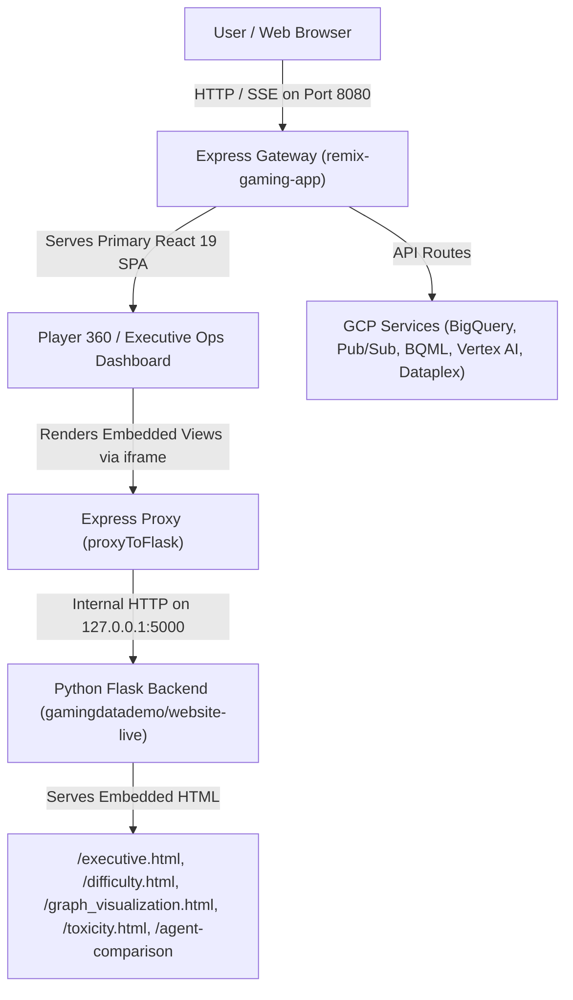

# Technical Plan: Fixing Frontend Routing & Deployment Regression (Player 360 vs. GamingDataDemo)

## Executive Overview & Problem Statement

During deployment via `./deploy-demo.sh` or local execution, a regression occurred where users were only presented with the legacy **OmniArcade GamingDataDemo** single-page Flask UI instead of the primary **Jingle Games Player 360 / Executive Operations Dashboard** (React 19 / Vite / Express gateway).

This document outlines the root cause analysis, architecture alignment, and step-by-step remediation plan to restore the intended multi-layer user experience.

---

## Architecture & Intended Application Flow

The platform is designed to operate as a **unified hybrid application**:

1. **Primary Frontend Gateway (`src/remix-gaming-app`)**:
   - Built with **React 19, Vite, TailwindCSS v4, and Express**.
   - Serves the **Player 360 & Executive Operations Dashboard** on `/`.
   - Features 15 integrated navigation sections (Overview, Knowledge Catalog, LiveOps Guardrail, Campaign Engine, IT Observatory, GCP Health, etc.).

2. **Internal Analytics & Visualization Engine (`src/gamingdatademo`)**:
   - Python Flask service (`website-live/app.py`) running internally on `127.0.0.1:5000`.
   - Provides backend APIs and renders specific embedded interactive views (`/executive.html`, `/difficulty.html`, `/marketing_swarm_visualizer.html`, `/graph_visualization.html`, `/toxicity.html`, `/agent-comparison`) via Express reverse proxy inside React `<iframe>` components (`FlaskSection.tsx`).

---

## Root Cause Analysis

### 1. Express Server Route Over-Capture (`server.ts`)
In [`src/remix-gaming-app/server.ts`](file:///usr/local/google/home/joeholley/Documents/repos/git/github.com/joeholley/dcgd/src/remix-gaming-app/server.ts), Express route handling for Flask proxying was capturing top-level static asset and root requests before static production asset serving or SPA fallback could execute:
- Route `/gamingdatademo` or `/agent-comparison` stripped the prefix and proxied `GET /` to Flask on port 5000.
- Flask's root route (`/`) returns `send_from_directory("static", "index.html")` — which is Flask's legacy single-page HTML application.
- If static asset requests (e.g. `/styles.css` or `/chat.js`) were intercepted by Flask proxy handlers, Flask's static handler hijacked page assets, causing top-level navigation to fall back to Flask's `index.html`.

### 2. Legacy Cloud Run Deployment Script Confusion (`src/gamingdatademo/website-live/deploy.sh`)
The legacy script `src/gamingdatademo/website-live/deploy.sh` directly deployed the single-component Flask app (`omniarcade-kc-demo-ui-live`) to Cloud Run. If invoked instead of the master runbook (`./deploy-demo.sh`), Cloud Run deployed only Flask, completely omitting the React 19 Player 360 frontend.

---

## Step-by-Step Remediation Plan

### Phase 1: Express Server Route Namespacing & Priority Fix
**Target File**: [`src/remix-gaming-app/server.ts`](file:///usr/local/google/home/joeholley/Documents/repos/git/github.com/joeholley/dcgd/src/remix-gaming-app/server.ts)

1. **Re-order Express Route Handlers**:
   - **Group A (API Endpoints)**: Dedicated Express API handlers (`/api/telemetry/stream`, `/api/chat`, `/api/system/gcp-health`, `/api/analytics/*`) handled first.
   - **Group B (Flask API & Embedded Page Proxies)**: Explicit Flask API (`/api/config`, `/api/table-info`, `/api/term-info`, etc.) and HTML page routes (`/executive.html`, `/difficulty.html`, `/marketing_swarm_visualizer.html`, `/graph_visualization.html`, `/toxicity.html`) proxied to `127.0.0.1:5000`.
   - **Group C (Primary React SPA & Static Assets)**: In production (`NODE_ENV=production`), `express.static(distPath)` and SPA wildcard (`app.get("*", ...)` returning `dist/index.html`) take strict precedence for all other paths (`/`, `/overview`, `/catalog`, `/operations`, `/guardrail`, etc.).

2. **Scope Flask Static Assets**:
   - Scope Flask-specific static assets under `/flask-static/*` or explicit sub-paths so they never collide with Vite's bundled CSS/JS in `dist/assets/`.

3. **Prevent Root Proxying to Flask**:
   - Ensure `/` NEVER proxies to Flask's `GET /` (which returns Flask's `index.html`).

---

### Phase 2: Container Entrypoint & Static Build Audit
**Target Files**:
- [`Dockerfile`](file:///usr/local/google/home/joeholley/Documents/repos/git/github.com/joeholley/dcgd/Dockerfile)
- [`entrypoint.sh`](file:///usr/local/google/home/joeholley/Documents/repos/git/github.com/joeholley/dcgd/entrypoint.sh)
- [`src/remix-gaming-app/package.json`](file:///usr/local/google/home/joeholley/Documents/repos/git/github.com/joeholley/dcgd/src/remix-gaming-app/package.json)

1. **Build Verification**:
   - Ensure `npm run build` inside `src/remix-gaming-app` runs cleanly without TypeScript or bundling errors, outputting `dist/index.html` and assets.

2. **Dockerfile Layer Verification**:
   - Verify `Dockerfile` Stage 1 builds `src/remix-gaming-app` and Stage 2 copies `/app/remix-gaming-app/dist` to `/app/remix-gaming-app/dist`.

3. **Process Supervision (`entrypoint.sh`)**:
   - Confirm `python3 website-live/app.py --host=127.0.0.1 --port=5000` is launched in the background.
   - Confirm `node dist/server.cjs` is launched in `/app/remix-gaming-app` on port 8080 (or `$PORT`) as the primary container process.

---

### Phase 3: Deployment Runbook (`deploy-demo.sh`) & Legacy Script Deprecation
**Target Files**:
- [`deploy-demo.sh`](file:///usr/local/google/home/joeholley/Documents/repos/git/github.com/joeholley/dcgd/deploy-demo.sh)
- [`src/gamingdatademo/website-live/deploy.sh`](file:///usr/local/google/home/joeholley/Documents/repos/git/github.com/joeholley/dcgd/src/gamingdatademo/website-live/deploy.sh)

1. **Master Runbook Verification (`deploy-demo.sh`)**:
   - Verify Step 7 (Cloud Build) compiles container from root `Dockerfile` and pushes to `data-cloud-ai-demos/gaming-app:latest`.
   - Verify Step 8 (Cloud Run) deploys service `omniarcade-app` in private mode.

2. **Legacy Script Deprecation / Alignment**:
   - Add a warning header to `src/gamingdatademo/website-live/deploy.sh` pointing users to `./deploy-demo.sh` to prevent accidental single-component deployments.

---

### Phase 4: Validation & Quality Assurance

| Test Case | Procedure | Expected Outcome |
|-----------|-----------|------------------|
| **1. React SPA Root Loading** | Open `http://localhost:8080/` | Renders Jingle Games Player 360 / Executive Ops Dashboard. |
| **2. React Section Navigation** | Click "Overview", "Knowledge Catalog", "LiveOps Guardrail" | Smooth SPA client-side section transitions. |
| **3. Embedded Flask Section** | Click "Executive Portfolio" (`/executive.html`) or "Difficulty Balancer" | Renders Flask HTML view cleanly inside `FlaskSection` `<iframe>`. |
| **4. Agent Comparison Route** | Navigate to `/agent-comparison` | Loads Agent Comparison view without hijacking top-level app. |
| **5. Container Startup** | Run `docker build -t test-app . && docker run -p 8080:8080 test-app` | Both Flask (5000) and Express (8080) start up; port 8080 serves React. |
