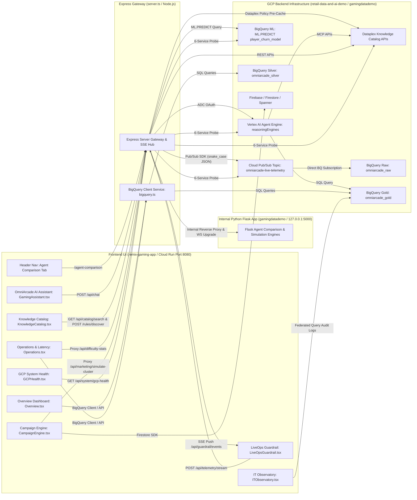

# Frontend-to-Backend Integration Mapping
## Remix Gaming App UI & GCP Backend Architecture

This document defines the architectural mapping between the frontend modules in **Remix Gaming App** (`src/remix-gaming-app`) and the GCP backend infrastructure provisioned via **retail-data-and-ai-demo** (`src/retail-data-and-ai-demo`) and **gamingdatademo** (`src/gamingdatademo`).

---

## 🔀 Cloud Run Routing & Dual Application Navigation

When deployed to Cloud Run, **both applications run concurrently in a single container** managed via `entrypoint.sh`:
- **`remix-gaming-app` (Express + React 19 UI)**: Listens on `0.0.0.0:$PORT` (default `8080`).
- **`gamingdatademo` (Python Flask App)**: Listens internally on `127.0.0.1:5000`.

### Full `gamingdatademo` Feature Preservations & Proxy Endpoints:
The Express Server Gateway (`server.ts`) proxies all `/agent-comparison/*`, `/api/gamingdatademo/*`, and Flask API/page endpoints internally to `http://127.0.0.1:5000` (including a dedicated TCP net socket upgrade proxy for `/api/ws` WebSockets), preserving **100% of `gamingdatademo`'s original features**:

1. **3-Tier Agent Comparison Workspace**:
   - **Route**: `https://<cloud-run-domain>/agent-comparison`
   - **Features**: Interactive comparison between Basic Agent (5 tables), Scaled Agent (150+ tables), and KC-Guided Agent (Dataplex Knowledge Catalog) with live WebSocket step-by-step query execution streaming and point-cloud animations.
2. **Dataplex Knowledge Catalog Inspection APIs**:
   - **Routes**: `/api/table-info`, `/api/term-info`
   - **Features**: Returns BigQuery column aspects, data quality scores, business glossary definitions (*Whale Spend*), and cross-table data lineage graphs.
3. **Operational & LiveOps Incident Simulation Engines**:
   - **ROAS Drop Simulator**: `/api/simulate/roas-drop` (Simulates marketing ROI drops).
   - **Player Cohort Cluster Simulator**: `/api/marketing/cohort-telemetry`, `/api/marketing/simulate-cluster`.
   - **Game Difficulty Spike Simulator**: `/api/difficulty-stats`, `/api/simulate/difficulty-spike` (Simulates level failure rate spikes).
   - **Executive Diagnostics Simulator**: `/api/executive/portfolio-metrics`, `/api/executive/simulate-diagnostics`.
   - **Trust & Safety Toxicity Simulator**: `/api/simulate/toxicity-incident`.

---

## 🏗️ System Architecture & Connection Diagram

---

## 🧱 Detailed UI Module to Backend Mapping

### 1. 🎮 LiveOps Churn Guardrail Split-Screen View ([LiveOpsGuardrail.tsx](../src/remix-gaming-app/src/components/sections/LiveOpsGuardrail.tsx))
* **Frontend Component**: Interactive game client simulator (Left Panel) & LiveOps Telemetry / Guardrail Observatory (Right Panel).
* **Express Routes**: `/api/telemetry/stream` (Telemetry ingestion) & `/api/guardrail/events` (Server-Sent Events / SSE Hub).
* **Target GCP Service**: **Cloud Pub/Sub (`omniarcade-live-telemetry`)** $\rightarrow$ **BigQuery Direct Subscription (`omniarcade_raw.live_session_events`)** $\rightarrow$ **BQML (`ML.PREDICT omniarcade_raw.player_churn_model`)** $\rightarrow$ **Dataplex Aspect Policy Verification (`liveops_campaign_policy_aspect`)**.
* **Data & Action Exchanged**:
  - Emits strict `snake_case` JSON session events (`boss_fail`, `consecutive_deaths`, `session_duration_seconds`) to `/api/telemetry/stream`.
  - Express server publishes messages to Pub/Sub topic `omniarcade-live-telemetry`, streaming into BigQuery `live_session_events` table in ~100ms.
  - Express executes immediate targeted BigQuery ML query: `ML.PREDICT(MODEL omniarcade_raw.player_churn_model, ...)`.
  - If predicted churn risk score $\ge 0.50$, Express triggers asynchronous Dataplex policy verification against aspect tag `liveops_campaign_policy_aspect`.
  - At churn risk score $\ge 0.85$, Express pushes pre-cached certified offer (`$0.99 Frost Giant Shield Pack`) via SSE payload to render in <300ms in the in-game UI pop-up:
    > *"That Frost Giant is tough! Grab a temporary 50% Shield Boost and 100 Health Elixirs for just $0.99 (normally $4.99) to defeat him now."*

---

### 2. 💬 OmniArcade Floating AI Assistant ([GamingAssistant.tsx](../src/remix-gaming-app/src/components/sections/GamingAssistant.tsx))
* **Frontend Component**: Floating chatbot drawer widget.
* **Express Route**: `/api/chat` in `server.ts`.
* **Target GCP Service**: **Vertex AI Agent Engine (`google-adk` / `reasoningEngines`)** authenticated via Application Default Credentials (ADC) with Model Context Protocol (MCP) tools.
* **Data & Action Exchanged**:
  - Accepts natural language queries from executives (e.g. *"Show total spend for Whale players in Japan"*).
  - Agent queries **Dataplex Knowledge Catalog** for schema aspect definitions and executes SQL against **BigQuery Gold tables** (`omniarcade_gold.gold_player_360`).
  - Returns structured AI answers, SQL query previews, table confidence scores, and dataset lineage links, with offline dev fallback.

---

### 3. 📚 Knowledge Catalog Explorer & Automatic Discovery ([KnowledgeCatalog.tsx](../src/remix-gaming-app/src/components/sections/KnowledgeCatalog.tsx))
* **Frontend Component**: Dataset search, metadata catalog browser, and **Automatic Rule Discovery Sandbox**.
* **Express Routes**: `/api/catalog/search` (Dataplex catalog search proxy) & `/api/catalog/rules/discover` (Rule compiler).
* **Target GCP Service**: **Dataplex Knowledge Catalog REST APIs** (`dataplex.googleapis.com`).
* **Data & Action Exchanged**:
  - **Catalog Search**: Searches cross-cloud datasets (BigQuery, Snowflake, AlloyDB, AWS S3) for glossaries (*Whale Spend*), custom aspect tags (`liveops_campaign_policy_aspect`), and data lineage.
  - **Automatic Rule Discovery Sandbox**: Allows non-SQL executives (VP of Marketing) to paste plain-text campaign execution criteria into the UI, automatically discovering business logic and compiling backend BigQuery row access policy SQL and Dataplex aspect tag schemas without typing SQL.

---

### 4. 📊 Executive Overview Dashboard ([Overview.tsx](../src/remix-gaming-app/src/components/sections/Overview.tsx))
* **Frontend Component**: Top-level executive KPI dashboard.
* **Target GCP Service**: **BigQuery Gold Analytical Tables** (`omniarcade_gold.gold_player_360`, `omniarcade_gold.gold_regional_kpis`) via BigQuery Client Adapter (`src/services/bigquery.ts`).
* **Data & Action Exchanged**:
  - Renders top-level executive metrics: Total Regional Revenue, Monthly Active Users (MAU), and Player Payer Tiers (*Whale, Dolphin, Minnow, F2P*).
  - Displays cross-cloud data lineage cards (AWS S3 cold logs, Snowflake monetization, AlloyDB live session concurrency) populated directly or via BigQuery Gold feature tables.

---

### 5. ⚡ Game Operations & Telemetry ([Operations.tsx](../src/remix-gaming-app/src/components/sections/Operations.tsx))
* **Frontend Component**: Operations telemetry & server capacity dashboard.
* **Target GCP Service**: **BigQuery Silver/Gold Telemetry Tables** (`omniarcade_silver.server_latency`, `omniarcade_gold.gold_regional_kpis`) + `gamingdatademo` `/api/difficulty-stats`.
* **Data & Action Exchanged**:
  - Renders interactive Recharts time-series performance graphs.
  - Monitors Concurrent Active Users (CCU), server region capacity utilization, frame rate latency, and unit economics.
  - Connects to `/api/simulate/difficulty-spike` (proxied to Flask) to simulate live level failure rate spikes and automated move-count re-balancing.

---

### 6. 🎯 Player Marketing Campaign Engine ([CampaignEngine.tsx](../src/remix-gaming-app/src/components/sections/CampaignEngine.tsx))
* **Frontend Component**: Targeted marketing campaign builder & budget allocator.
* **Target GCP Service**: **Firebase / Firestore** (`src/services/firebase.ts`) + **BigQuery Gold Tables** (`omniarcade_gold.gold_campaign_analytics`) + `gamingdatademo` `/api/marketing/*`.
* **Data & Action Exchanged**:
  - Queries BigQuery `gold_player_360` & `gold_campaign_analytics` to calculate target player cohort sizes (e.g. inactive Whales in Japan).
  - Stores campaign state in Firestore with offline mock fallback, syncing to BigQuery for campaign performance and ROI tracking.
  - Invokes `/api/marketing/simulate-cluster` (proxied to Flask) to dynamically test marketing cohort budget reallocations and multi-agent recovery plans.

---

### 7. 🛰️ IT Observatory & GCP Health ([ITObservatory.tsx](../src/remix-gaming-app/src/components/sections/ITObservatory.tsx) & [GCPHealth.tsx](../src/remix-gaming-app/src/components/sections/GCPHealth.tsx))
* **Frontend Component**: System health and API observatory.
* **Target GCP Service**: **BigQuery Audit Logs**, **GCP Health Diagnostic Endpoint** (`/api/system/gcp-health`) + `gamingdatademo` `/api/simulate/toxicity-incident`.
* **Data & Action Exchanged**:
  - Renders real-time API throughput charts, response time latency distributions, query cost estimates, and 6-service GCP health probes (Auth/ADC, BigQuery, Pub/Sub, BQML, Dataplex, Vertex AI Agent).
  - Executes community trust & safety toxicity incident simulations.

---

### 8. 🤖 Gameplay & Player Ops Agentic Workflows ([AgenticWorkflows.tsx](../src/remix-gaming-app/src/components/sections/AgenticWorkflows.tsx))
* **Frontend Component**: Interactive multi-agent workflow simulator (Player Retention Promo, Cheat & Anomaly Detection, Matchmaking Queue Balancer).
* **Target GCP Service**: **Vertex AI Agent Engine** + **Dataplex Knowledge Catalog Policy Checks**.
* **Data & Action Exchanged**:
  - Renders interactive agentic pipeline diagrams, live thought traces, and reward gift card previews.
  - Simulates multi-step autonomous agent decision loops for LiveOps player retention and anti-cheat enforcement.

---

## 📋 Component Connection Summary Matrix

| Frontend Module | UI Component File | Target Backend Service | Primary Data Exchanged |
| :--- | :--- | :--- | :--- |
| **LiveOps Guardrail** | [LiveOpsGuardrail.tsx](../src/remix-gaming-app/src/components/sections/LiveOpsGuardrail.tsx) | Cloud Pub/Sub $\rightarrow$ BQ Direct Sub $\rightarrow$ BQML `ML.PREDICT` $\rightarrow$ Dataplex Aspect Policy Verification | Streaming game telemetry, predictive ML churn probability, pre-cached certified offer pop-ups ($0.99 Shield Pack). |
| **Agent Comparison Workspace** | Header Tab / `/agent-comparison` | `gamingdatademo` Flask Service (`127.0.0.1:5000`) via `/api/ws` | Side-by-side Basic, Scaled, and KC Agent query step streaming and point-cloud animations. |
| **AI Assistant** | [GamingAssistant.tsx](../src/remix-gaming-app/src/components/sections/GamingAssistant.tsx) | Vertex AI Agent Engine (`reasoningEngines`) + Dataplex MCP | Natural language QA, schema resolution, BigQuery Gold SQL query results. |
| **Catalog Explorer & Auto-Discovery** | [KnowledgeCatalog.tsx](../src/remix-gaming-app/src/components/sections/KnowledgeCatalog.tsx) | Dataplex Knowledge Catalog REST APIs (`/api/catalog/*`) | Glossaries, aspect tags, quality scores, lineage, and Automatic Rule Discovery Sandbox. |
| **Executive Overview** | [Overview.tsx](../src/remix-gaming-app/src/components/sections/Overview.tsx) | BigQuery Gold (`gold_player_360`, `gold_regional_kpis`) via `bigquery.ts` | Regional revenue, MAU, player spend tiers (*Whales/Minnows*), cross-cloud lineage. |
| **Operations Telemetry** | [Operations.tsx](../src/remix-gaming-app/src/components/sections/Operations.tsx) | BigQuery Silver (`server_latency`) + `/api/simulate/difficulty-spike` | Real-time concurrent active users (CCU), server region capacity, difficulty spike simulation. |
| **Campaign Engine** | [CampaignEngine.tsx](../src/remix-gaming-app/src/components/sections/CampaignEngine.tsx) | Firebase / Firestore + `/api/marketing/simulate-cluster` | Target player cohort sizing, campaign CRUD state, marketing cluster simulation. |
| **IT Observatory & GCP Health** | [ITObservatory.tsx](../src/remix-gaming-app/src/components/sections/ITObservatory.tsx) & [GCPHealth.tsx](../src/remix-gaming-app/src/components/sections/GCPHealth.tsx) | BigQuery Audit Logs + `/api/system/gcp-health` + `/api/simulate/toxicity-incident` | API throughput, latency distribution, system health checks, toxicity incident simulation. |
| **Agentic Workflows** | [AgenticWorkflows.tsx](../src/remix-gaming-app/src/components/sections/AgenticWorkflows.tsx) | Vertex AI Agent Engine + Dataplex Policy Checks | Multi-agent retention, anti-cheat, and matchmaking thinking traces and workflow previews. |

---

## 🛠️ Current Implementation & Verification Status

1. **Express Server Gateway (`server.ts`)**:
   - **Pub/Sub Integration**: Uses `@google-cloud/pubsub` SDK to publish live telemetry events to topic `omniarcade-live-telemetry` with strict `snake_case` keys and ISO-8601 timestamps.
   - **BQML Inference**: Executes targeted `ML.PREDICT` query on incoming telemetry events, evaluating churn risk probability and pushing live ML scores via Server-Sent Events (SSE).
   - **Dataplex Policy Pre-Caching**: Pre-caches certified promotional offers (`$0.99 Frost Giant Shield Pack`) in-memory when BQML churn score crosses 50%, enabling <300ms execution on critical trigger ($\ge 85\%$).
   - **Dataplex Catalog & Rule Discovery**: Implements `/api/catalog/search` and `/api/catalog/rules/discover` for plain-text rule compilation to BigQuery row access policies and aspect schemas.
   - **Dual-App Reverse Proxy**: Implements HTTP reverse proxying and TCP net socket upgrade proxying (`/api/ws`) to internal Python Flask app (`127.0.0.1:5000`).
   - **Vertex AI Agent Engine**: Connects `/api/chat` via Application Default Credentials (ADC) to Vertex AI Reasoning Engines.

2. **BigQuery & Database Provisioning**:
   - **Terraform-Provisioned BQ Tables**: `omniarcade_raw.gcp_players`, `omniarcade_raw.live_session_events`, `omniarcade_raw.iap_transactions`, `omniarcade_gold.gold_player_360` (`retail-data-and-ai-demo`), and medallion datasets `telemetry_bronze`, `telemetry_silver`, `telemetry_gold`, `telemetry_reference`, `telemetry_dashboards` (`gamingdatademo`).
   - **Client Adapter (`src/services/bigquery.ts`)**: Provides parameterized query execution against BQ Gold tables with automatic dev fallback data for unprovisioned tables (`gold_regional_kpis`, `gold_campaign_analytics`, `server_latency`).
   - **Operational Storage**: Spanner / AlloyDB represent target architecture patterns (unprovisioned in Terraform); active state management uses Firebase / Firestore (`src/services/firebase.ts`) with offline mock fallback.

3. **Multi-Service GCP Health Diagnostics (`/api/system/gcp-health`)**:
   - Provides unified real-time health probe across 6 GCP backend components (ADC Auth, BigQuery, Pub/Sub, BQML Model, Dataplex, Vertex AI Agent).