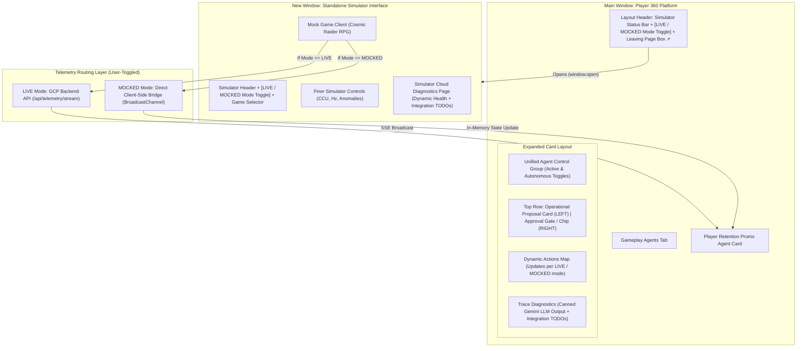
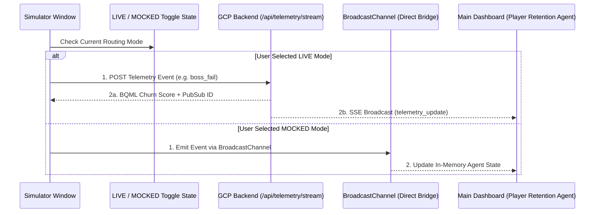
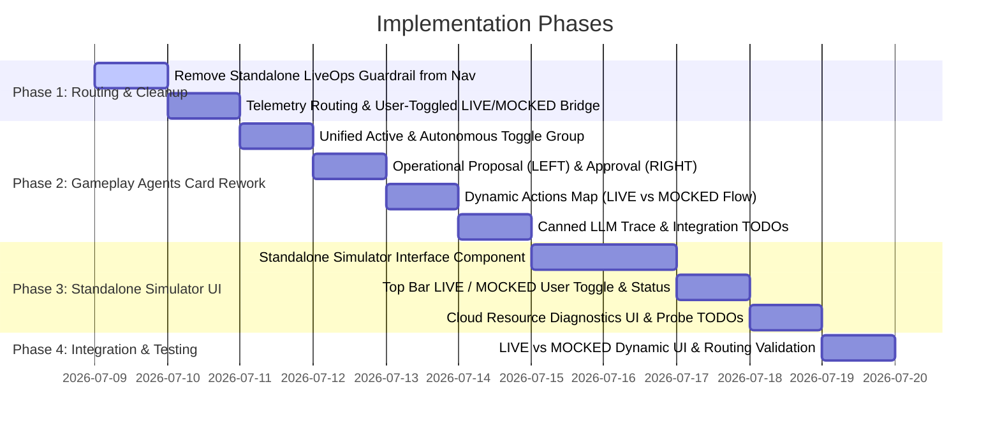

# LiveOps Guardrail & Standalone Game Simulator Revision Plan

## Executive Overview

This document outlines the frontend architecture and component revisions for relocating the **LiveOps Guardrail** functionality into the **Gameplay Agents** tab (specifically within the **Player Retention Promo Agent** card), and creating a standalone, multi-window **Game Telemetry Simulator Interface** with user-controllable LIVE vs MOCKED telemetry routing, dynamic architecture UI updates, and clear integration affordances (TODOs) for future backend probes and live APIs.

---

## 1. LiveOps Guardrail Relocation & Card Redesign

### 1.1. Sidebar & Router Cleaning
- **Sidebar (`Layout.tsx`)**: Completely remove the standalone "LiveOps Guardrail" item from the *LiveOps & Automation* nav category (no redirection).
- **Main Router (`App.tsx`)**: Remove `"guardrail"` from `Section` type and remove `<LiveOpsGuardrail />` route. All guardrail capabilities are fully integrated into `<AgenticWorkflows />` (*Gameplay Agents*).

### 1.2. Player Retention Promo Agent Card Header & Unified Toggle Control Group
- **Expand/Collapse Arrow**:
  - Left-aligned chevron expand/collapse arrow button on the card header.
  - Toggling this arrow expands or collapses the detailed agent workspace independently of whether the agent is active.
- **Unified Agent Control Group**:
  - A cohesive **Agent Control Group UI** in the top-right of the card header (styled pill-shaped container).
  - Contains two integrated switches:
    1. **Active Switch**: Enables/disables single-invocation or continuous agent execution.
    2. **Autonomous Switch**: Enables/disables autonomous decision-making and automated policy execution.
  - **Coupling Logic**:
    - Turning **ON** Autonomous mode automatically sets Active to **ON** if not already active.
    - Turning **OFF** Active mode automatically sets Autonomous to **OFF**.

### 1.3. Expanded Card Content & Layout Rework
- **Top Row (Below Agent Title & Toggles)**:
  - **LEFT SIDE**: **Operational Proposal Card**:
    - Displays developer-facing operational aspects of the offer:
      - Target Cohort (e.g., *Cosmic Raider RPG - Veteran Whale Cohort*)
      - Certified Reward SKU (e.g., `frost_giant_shield_pack`)
      - Dataplex Aspect ID (`liveops-campaign-policy-aspect`)
      - Max Allowed Discount Boundary (e.g., `85%`)
      - Priority & Estimated LTV at risk ($85K exposure).
  - **RIGHT SIDE**: **Developer Approval Gate / Status Chip**:
    - Positioned directly on the right to align with proposal review.
    - In Single-Invocation mode: Actionable `Approve & Inject Script` button.
    - In Autonomous mode: Status chip (see Section 1.4).

- **Dynamic Actions Map (LIVE vs. MOCKED Data Flow)**:
  - The Actions Map dynamically adapts its nodes and flow diagram depending on the user-controlled **LIVE / MOCKED** mode toggle:
    - **LIVE Mode Diagram**:
      $$\text{Simulator Game Client} \longrightarrow \text{Pub/Sub} \longrightarrow \text{BigQuery} \longrightarrow \text{BQML Churn Model + Dataplex KC} \longleftarrow \text{Gemini Enterprise Agent}$$
    - **MOCKED Mode Diagram**:
      $$\text{Simulator Game Client} \longrightarrow \text{In-Memory BroadcastBridge} \longrightarrow \text{Mock BQML Rule Engine} \longleftarrow \text{Mock LLM Prompt Playback}$$
  - Dynamic status indicators (*Pending*, *Active*, *Completed*, *Policy Verified*) for each node in the chain during execution.

- **Trace Diagnostics (Canned Playback with Integration & Probe TODOs)**:
  - Implement full UI container for LLM trace diagnostics.
  - Populate with realistic canned log responses that play back step-by-step in mock mode (e.g. prompt construction, Dataplex aspect query, BQML inference evaluation, final JSON offer output).
  - *Integration Affordance & TODO Placement*:
    - **Trace Stream Integration TODO**:
      `// TODO: [Backend Integration - Trace API] Replace canned log array with EventSource('/api/guardrail/agent-trace') or WebSocket stream from Vertex AI Reasoning Engine`
    - **Prompt Context Integration TODO**:
      `// TODO: [Backend Integration - Prompt Context] Inject live player context fetched from BigQuery gold_player_360 table into system prompt buffer`

### 1.4. Operational Modes (Single-Invocation vs. Autonomous)

| Feature | Single-Invocation Mode (Active ON, Autonomous OFF) | Autonomous Mode (Active ON, Autonomous ON) |
| :--- | :--- | :--- |
| **Execution Flow** | Manual trigger / single telemetry evaluation | Continuous live evaluation of incoming telemetry stream |
| **Proposal View** | Static single Operational Proposal on LEFT | Live scrolling log of proposals evaluated by the agent on LEFT |
| **Approval Gate (RIGHT)** | Interactive button: `[Approve & Inject Script]` | Status Chip: `[APPROVED BY AGENT]` (Green) or `[REJECTED - DATAPLEX POLICY]` (Amber) |
| **Hover Tooltip on Chip** | Basic approval info | Rich context tooltip detailing policy decision rationale (Dataplex aspect check result, max discount limit, BQML churn score, player tier) |

---

## 2. Game Simulator Revamp & Standalone Interface

### 2.1. Top Bar Simulator Status & User-Controlled LIVE/MOCKED Toggle
- **Main Dashboard Top Bar (`Layout.tsx`)**:
  - CCU counter (e.g. `14,280 CCU`).
  - Active anomaly selector.
  - Simulator ON/OFF toggle.
  - **User-Controlled Mode Switch**: Interactive toggle pill allowing the user to explicitly force:
    - **`LIVE (GCP)`**: Telemetry is posted to `/api/telemetry/stream` and processed via Cloud Pub/Sub and BQML.
    - **`MOCKED (In-Memory)`**: Telemetry bypasses backend and routes directly through in-memory BroadcastChannel.
  - **Leaving Page Box**: Clickable box button with external link arrow icon (`SquareArrowOutUpRight` / `ExternalLink`) that opens the standalone Simulator Interface in a new window (`window.open('/simulator', '_blank')`).

- **Standalone Simulator Top Bar (`SimulatorInterface.tsx`)**:
  - Mirror the **LIVE / MOCKED Mode Toggle** so the user can control routing from either window.

### 2.2. Telemetry Routing & Data Flow

### 2.3. Standalone Simulator Interface (`SimulatorInterface.tsx`)
- **Header & Mode Control**: User-controllable LIVE / MOCKED toggle, simulator status, and tab switcher (*Mock Game Client* vs. *Cloud Resource Diagnostics*).
- **Finer Simulator Controls**:
  - Event publishing frequency (Hz slider: 0.5Hz to 10Hz).
  - Target CCU multiplier / slider.
  - Anomaly injection triggers.
- **Mock Game Selector & Client**:
  - Selector for mock game profiles (starts with *Cosmic Raider RPG* Frost Giant boss fight).
  - Relocated game client UI from LiveOps Guardrail with simulated telemetry actions (*Fail Encounter*, *Quit Mission*, *Accept & Purchase Offer*).
  - *Telemetry Stream Integration TODO*:
    `// TODO: [Backend Integration - Telemetry Stream] Wire up real-time gRPC / WebSockets stream to Cloud Pub/Sub topic 'omniarcade-live-telemetry'`

### 2.4. Simulator Cloud Diagnostics Page (`SimulatorDiagnostics.tsx`)
- **UI & Dynamic Health State**:
  - Complete UI displaying health / connectivity status for all GCP resources:
    1. **Cloud Pub/Sub**: Topic `omniarcade-live-telemetry`
    2. **BigQuery**: Dataset `omniarcade_gold` / Table `gold_player_360`
    3. **BQML**: Model `omniarcade_raw.player_churn_model`
    4. **Dataplex Knowledge Catalog**: Governance Aspect `liveops-campaign-policy-aspect`
    5. **Vertex AI / Gemini Enterprise**: Agent Engine `omniarcade-guardrail-agent`
  - In **LIVE Mode**: Probes display active connection metrics or simulated live ping status.
  - In **MOCKED Mode**: Probes clearly display `MOCKED (OFFLINE SIMULATION)` status.

- **Explicit Integration & Health Probe TODO Placement**:

| Component / Service | Integration Target (Where to Wire Live API) | Code File & TODO Placement |
| :--- | :--- | :--- |
| **Cloud Pub/Sub Probe** | `@google-cloud/pubsub` `topic.exists()` check | `SimulatorDiagnostics.tsx` -> `// TODO: [Backend Probe] Wire up pubsubClient.topic('omniarcade-live-telemetry').exists()` |
| **BigQuery Table Probe** | `@google-cloud/bigquery` table metadata ping | `SimulatorDiagnostics.tsx` -> `// TODO: [Backend Probe] Wire up bigqueryClient.dataset('omniarcade_gold').table('gold_player_360').exists()` |
| **BQML Model Probe** | BigQuery ML model metadata query (`INFORMATION_SCHEMA.MODELS`) | `SimulatorDiagnostics.tsx` -> `// TODO: [Backend Probe] Wire up SELECT * FROM omniarcade_raw.INFORMATION_SCHEMA.MODELS WHERE model_name='player_churn_model'` |
| **Dataplex Aspect Probe** | Dataplex REST API `entries:search` or AspectType lookup | `SimulatorDiagnostics.tsx` -> `// TODO: [Backend Probe] Wire up fetch('https://dataplex.googleapis.com/v1/projects/.../aspectTypes/liveops-campaign-policy-aspect')` |
| **Vertex AI Agent Probe** | Vertex AI Reasoning Engine `reasoningEngines.get` API | `SimulatorDiagnostics.tsx` -> `// TODO: [Backend Probe] Wire up fetch('https://us-central1-aiplatform.googleapis.com/v1/.../reasoningEngines/omniarcade-guardrail-agent')` |
| **Telemetry Event Stream** | `/api/telemetry/stream` POST endpoint | `src/services/simulatorBridge.ts` -> `// TODO: [Backend Integration] Wire up live gRPC / HTTP2 stream to Cloud Pub/Sub ingestion gateway` |
| **LLM Trace Diagnostics** | `/api/chat` or Vertex AI Reasoning Engine WebSocket | `AgenticWorkflows.tsx` -> `// TODO: [Backend Integration] Wire up WebSocket listener for live Gemini LLM reasoning step-by-step trace` |

---

## 3. Step-by-Step Implementation Roadmap

### Phase 1: Routing & Nav Cleanup
1. In `Layout.tsx`, remove "LiveOps Guardrail" from sidebar navigation.
2. In `App.tsx`, remove `guardrail` section and component route.
3. Build `src/remix-gaming-app/src/services/simulatorBridge.ts`:
   - State store for user-selected `dataRoutingMode` (`LIVE` vs `MOCKED`).
   - `sendSimulatorEvent()` helper: checks `dataRoutingMode`; if `LIVE`, posts to `/api/telemetry/stream`; if `MOCKED`, emits via `BroadcastChannel`.

### Phase 2: Gameplay Agents Card Rework (`AgenticWorkflows.tsx`)
1. **Header**:
   - Add left-aligned expand/collapse arrow.
   - Build unified **Agent Control Group** with Active and Autonomous toggles + coupling logic.
2. **Body**:
   - Top row: Operational Proposal on LEFT, Developer Approval Gate (or Autonomous Status Chip with hover tooltip) on RIGHT.
   - Dynamic Actions Map: renders GCP cloud pipeline when in `LIVE` mode, or in-memory fallback pipeline when in `MOCKED` mode.
   - Trace Diagnostics: Canned LLM trace playback + explicit `// TODO: [Backend Integration]` comments for trace stream & prompt context.

### Phase 3: Standalone Simulator Interface & Diagnostics
1. Create `src/remix-gaming-app/src/components/sections/SimulatorInterface.tsx`:
   - Header with user-controllable LIVE / MOCKED mode toggle.
   - Finer controls (Hz, CCU, anomaly injection).
   - Mock game client (Cosmic Raider RPG) with telemetry TODOs.
2. Create `src/remix-gaming-app/src/components/sections/SimulatorDiagnostics.tsx`:
   - UI for Pub/Sub, BigQuery, BQML, Dataplex, Gemini Enterprise connectivity.
   - Dynamic status reflecting LIVE vs MOCKED mode.
   - Explicit `// TODO: [Backend Probe]` comments for all 5 GCP services.
3. In `Layout.tsx` top bar:
   - Add **LIVE / MOCKED Mode Toggle** to simulator status bar.
   - Add "Leaving this page" box button with external link arrow opening `/simulator`.

### Phase 4: Verification & Testing
1. Test sidebar navigation: verify LiveOps Guardrail is removed.
2. Test toggle coupling in Player Retention Promo Agent card.
3. Test LIVE vs. MOCKED mode toggle on main dashboard & simulator window: verify Actions Map and Diagnostics UI update dynamically.
4. Test single-window and multi-window operation under both routing modes.

---

## 4. Verification & Acceptance Criteria

- [ ] **Sidebar Removal**: LiveOps Guardrail is completely removed from sidebar nav (no redirection).
- [ ] **Unified Toggles**: Active and Autonomous toggles are neatly styled in a unified UI control group; turning Autonomous ON forces Active ON.
- [ ] **Proposal & Approval Layout**: Operational Proposal is on the LEFT; Developer Approval Gate / Status Chip is on the RIGHT.
- [ ] **User-Controlled LIVE / MOCKED Toggle**: Added interactive toggle in both main top bar and simulator header to switch between GCP backend and in-memory mock mode.
- [ ] **Dynamic Actions Map**: Actions map visually updates between GCP Cloud Pipeline (LIVE) and In-Memory Bridge (MOCKED).
- [ ] **LLM Trace & Telemetry Integration TODOs**: Explicit code comments for live trace streaming, prompt context injection, and gRPC/WebSocket telemetry.
- [ ] **GCP Health Probe TODOs**: Explicit code comments in `SimulatorDiagnostics.tsx` for Pub/Sub, BigQuery, BQML, Dataplex, and Vertex AI liveness checks.
- [ ] **Standalone Simulator**: External link button opens simulator window with finer controls, mock RPG game client, and dynamic GCP resource diagnostics UI.
