# Technical Specification: Telemetry Simulator, Exemplar State, & Diagnostics Refactor

## Executive Summary & Objectives

This engineering specification outlines the refactoring requirements for the Telemetry Simulator, Cloud Diagnostics Monitor, Cohort Exemplars, and Interactive Client State in [`src/remix-gaming-app`](file:///usr/local/google/home/joeholley/Documents/repos/git/github.com/joeholley/dcgd/src/remix-gaming-app). 

The goal of this refactor is to enforce **strict per-exemplar state isolation**, align cohort sampling with **BigQuery Gold Table (`gold_player_360`) statistics**, establish a standard **Firebase Realtime Database offer-acceptance schema**, streamline the **Cloud Diagnostics view**, and enhance **CCU visualization controls**.

---

## High-Level System Architecture & Event Flow

```mermaid
sequenceDiagram
    autonumber
    actor Ops as LiveOps Operator
    participant SimUI as Simulator Interface (MockClientTab.tsx)
    participant Bus as In-Memory Mock Event Bus (server.ts)
    participant BQ as BigQuery Gold Table (gold_player_360)
    participant Log as Telemetry Log (SimulatorTelemetryLog.tsx)

    rect rgb(20, 30, 50)
        note right of SimUI: 1. Cohort & Exemplar Resolution
        alt Live GCP Mode
            SimUI->>BQ: Query random exemplar per cohort (ORDER BY RAND() LIMIT 1) + Predictive LTV
            BQ-->>SimUI: Real Exemplar Profile (Player ID, Spend, LTV Prediction)
        else Mock Fallback Mode
            SimUI->>SimUI: Generate Default Mock Exemplar (Whale / Dolphin / Minnow / F2P)
        end
    end

    rect rgb(25, 45, 30)
        note right of Bus: 2. Isolated Game Simulation & Offer Evaluation
        Ops->>SimUI: Click "Try Again" (Resets Boss HP 100% -> Subtractive Hit)
        SimUI->>Bus: Stream Telemetry Event (Tagged with Current Active Mode: Live/Mock)
        Bus-->>Log: Append Event Record (Preserves Mode Badge at Arrival Time)
        alt Churn Score >= 0.85 & Offer Pending
            Bus-->>SimUI: Broadcast Offer Approval Payload
            SimUI->>SimUI: Render Offer Modal (if offers_accepted[offer_name] == false)
            SimUI->>SimUI: Accept Offer -> Update JSON payload key "offers_accepted".${offer_name} = true
        end
    end
```



---

## Detailed Technical Specifications

### Module 1: Cloud Resources Diagnostics Refactoring

#### Scope & Requirements:
1. **Diagnostic View Restriction**:
   - The Cloud Resources Diagnostics panel in [`SimulatorDiagnostics.tsx`](file:///usr/local/google/home/joeholley/Documents/repos/git/github.com/joeholley/dcgd/src/remix-gaming-app/src/components/sections/SimulatorDiagnostics.tsx) must display **only two products**:
     1. **Cloud Pub/Sub Telemetry Topic** (`gaming-live-telemetry`).
     2. **Player Profiles in Firebase Realtime Database**.
2. **Firebase Status Badge**:
   - The status badge for **Firebase Realtime Database** must be explicitly marked as `"NOT YET IMPLEMENTED"` with an amber info indicator.
3. **In-Memory Communication Channel (Mock Mode)**:
   - When running under the Mock Backend, offer notifications sent from the operational backend application to the mock client MUST be transmitted over an **in-memory event broadcast channel** (Express SSE / internal EventEmitter).
   - Standpoint of the Mock Client: An incoming message stream listening for offer display approvals for a specific exemplar.
4. **Offer State & Firebase Realtime Database Data Format**:
   - On initial load, all exemplars start with zero active/accepted offers.
   - When an offer is broadcasted over the channel, the mock client caches it in-memory.
   - Offer acceptance MUST be saved according to the Firebase Realtime Database JSON schema format:
     ```json
     {
       "player_profile": {
         "${player_id}": {
           "offers_accepted": {
             "${offer_name}": true
           }
         }
       }
     }
     ```
   - **Dot-Notation Schema Definition**:
     `"player_profile".${player_id}."offers_accepted".${offer_name}` = `boolean` (`true` | `false`)
     - `true`: Offer is already accepted. The mock client CANNOT display or present this offer again.
     - `false`: Offer is currently available and MUST be presented to the user in the mock client UI.

---

### Module 2: Cohort Exemplars & Payer Tier Management

#### Scope & Requirements:
1. **Payer Tier Definitions**:
   In `gaming_gold.gold_player_360`, four primary `payer_tier` cohorts exist based on cumulative lifetime spend (`total_iap_spend`):

   | Payer Tier | Total Spend Criteria | Description |
   | :--- | :--- | :--- |
   | **Whale** | $> \$500.00$ | High-value monetization cohort driving major revenue. |
   | **Dolphin** | $\$50.00 - \$500.00$ | Mid-tier regular purchasers. |
   | **Minnow** | $\$0.01 - \$49.99$ | Low-tier or occasional impulse item buyers. |
   | **F2P** | $\$0.00$ | Free-to-Play non-spending cohort (`COALESCE(payer_tier, 'F2P')`). |

2. **Mock Simulator Exemplars (Default Fallback)**:
   - Provide pre-populated default mock player profiles for all 4 cohorts with randomized initial spend values towards the lower end of each tier range.
   - Selecting a cohort chip in the simulator sets the mock game client card to take on that cohort's exemplar role.

3. **Live GCP Backend Exemplars (BigQuery Integration)**:
   - When switching to the Live GCP Backend, fetch one random real exemplar per cohort directly from BigQuery using `ORDER BY RAND() LIMIT 1`:

```sql
SELECT
  player_id,
  payer_tier,
  total_iap_spend,
  days_since_last_login,
  favorite_category,
  consecutive_deaths,
  session_duration_seconds,
  is_churned
FROM `${PROJECT_ID}.gaming_gold.gold_player_360`
WHERE payer_tier = @target_tier
   OR ( @target_tier = 'Whale' AND total_iap_spend > 500.0 )
ORDER BY RAND()
LIMIT 1;
```
*(Note: Code must perform runtime `PROJECT_ID` substitution.)*

4. **Predictive LTV Model Integration & Fallback**:
   - For live exemplars, execute a prediction query using `gaming_gold.gaming_predictive_ltv_model`.
   - **Fallback Rule**: If the model is inaccessible or returns an invalid/null response, display the top boundary of the tier range ($500 for Dolphin, $50 for Minnow, $0 for F2P, $1,500 cap for Whale).
   - Exemplars are fetched **once** upon backend connection and cached in memory until app restart.

5. **Cohort Selection Chips UI**:
   - Display player name, estimated LTV, and current total spend on cohort selection chips:
     `[ Whale: Player_0042 | Spend: $750 | LTV: $1,250 ]`
   - Dynamically update chip metrics in real time when toggling between Live and Mock backends.

---

### Module 3: Isolated Per-Exemplar Client State & Interaction Logic

#### Scope & Requirements:
1. **State Isolation**:
   - Offer history, offer acceptance, deaths, churn events, and boss health MUST be stored in a per-exemplar Map:
     ```typescript
     interface ExemplarState {
       playerId: string;
       tier: "Whale" | "Dolphin" | "Minnow" | "F2P";
       bossHp: number;
       consecutiveDeaths: number;
       churnEvents: number;
       offersAccepted: Record<string, boolean>; // key: offer_name -> true/false
       activeOffer: OfferPayload | null;
     }
     ```
   - Switching cohort selection MUST swap active state context without bleeding state into other cohorts.

2. **Boss Failure Button Refactor ("Try Again")**:
   - Rename UI button text from "Boss Fail" / "Simulate Death" to **"Try Again"**.
   - **Click Handling Behavior**:
     1. Instantly refill boss HP bar to **100%**.
     2. Run a attack animation simulation.
     3. Deduct a random hit amount from the boss HP bar (e.g. 30%–60%) that is **guaranteed not to kill the boss**.
     4. Increment `consecutiveDeaths` count for the active exemplar and emit telemetry event.

3. **Offer Re-Evaluation & Acceptance Sequence**:
   - Accepting an offer sets `"offers_accepted".${offer_name}` = `true` in the exemplar state.
   - Subsequent "Try Again" clicks will evaluate telemetry score. If churn threshold triggers again, the mock client verifies `offers_accepted[offer_name]`. Because it is `true`, the UI MUST suppress the modal popup.

---

### Module 4: Telemetry Log & CCU Visualization Adjustments

#### Scope & Requirements:
1. **Telemetry Event Log State Preservation**:
   - Fix bug in [`SimulatorTelemetryLog.tsx`](file:///usr/local/google/home/joeholley/Documents/repos/git/github.com/joeholley/dcgd/src/remix-gaming-app/src/components/sections/SimulatorTelemetryLog.tsx): Toggling backend state between Live and Mock currently updates past log badges retroactively.
   - **Fix**: Each telemetry event object must retain an immutable `backend_mode: "LIVE" | "MOCK"` property captured at the exact moment of event emission.

2. **CCU Graph Readout & Layout Adjustments** in [`DiurnalSineWaveGraph.tsx`](file:///usr/local/google/home/joeholley/Documents/repos/git/github.com/joeholley/dcgd/src/remix-gaming-app/src/components/sections/DiurnalSineWaveGraph.tsx):
   - **Label Rename**: Change top PCCU readout label to **"CCU/PCCU"**.
   - **Default PCCU Value**: Initialize peak CCU slider default value to **250,000 (250k)**.
   - **Regional CCU Wave Floor**: Update regional sine wave calculation logic so minimum CCU never drops below **1% of regional peak** (prevent zero-line drops).
   - **Clock Repositioning**: Shift local time clock display to the upper-right control header to prevent visual overlap with regional timezone timestamps.
   - **Enhanced Mouseover Tooltip**: Display regional timestamps alongside regional CCU values on graph hover.

---

## Targeted Files & Action Items Summary

| Component File | Key Modifications |
| :--- | :--- |
| [`SimulatorDiagnostics.tsx`](file:///usr/local/google/home/joeholley/Documents/repos/git/github.com/joeholley/dcgd/src/remix-gaming-app/src/components/sections/SimulatorDiagnostics.tsx) | Restrict panel to Pub/Sub and Firebase RTDB ("Not Yet Implemented"). |
| [`MockClientTab.tsx`](file:///usr/local/google/home/joeholley/Documents/repos/git/github.com/joeholley/dcgd/src/remix-gaming-app/src/components/sections/MockClientTab.tsx) | Implement 4-tier cohort exemplars, per-exemplar state map, "Try Again" boss HP logic, and Firebase offer schema. |
| [`server.ts`](file:///usr/local/google/home/joeholley/Documents/repos/git/github.com/joeholley/dcgd/src/remix-gaming-app/server.ts) | Add `RAND()` BQ sampling endpoint per cohort, predictive LTV model query fallback, and in-memory offer SSE broadcast. |
| [`SimulatorTelemetryLog.tsx`](file:///usr/local/google/home/joeholley/Documents/repos/git/github.com/joeholley/dcgd/src/remix-gaming-app/src/components/sections/SimulatorTelemetryLog.tsx) | Store immutable `backend_mode` on incoming events to prevent retroactive badge updates. |
| [`DiurnalSineWaveGraph.tsx`](file:///usr/local/google/home/joeholley/Documents/repos/git/github.com/joeholley/dcgd/src/remix-gaming-app/src/components/sections/DiurnalSineWaveGraph.tsx) | Update header to "CCU/PCCU", set default PCCU to 250k, enforce 1% wave floor, add mouseover timestamps, and move clock position. |
