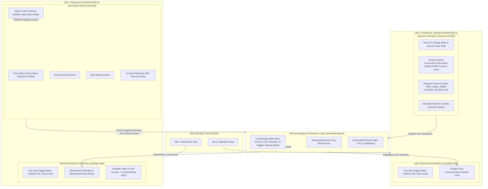
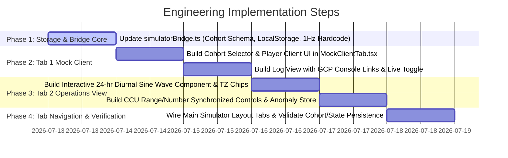

# Engineering Plan: Standalone Game Simulator Frontend Refactor

## Executive Overview & Document Metadata

- **Target Audience**: Frontend Engineering Team & System Integrators
- **Objective**: Refactor the **OmniArcade Telemetry Simulator Interface** into a two-tab architecture:
  1. **Mock Client View**: Clean, player-facing mock RPG game client featuring a selectable Player Cohort dropdown (defaulting to High Value Whale), paired with a real-time behind-the-scenes operator telemetry log (featuring Pub/Sub status marks and clickable GCP Console links).
  2. **Operations View**: Operator control center featuring an interactive 24-hour multi-region diurnal sine wave CCU graph, timezone toggles, anomaly injection selectors, hardcoded 1 Hz telemetry generation, and persistent application state.
- **Scope Notice**: This document is a complete technical specification for engineers. No application source code changes are executed by this document generation step.

---

## Architecture & System Overview



---

## 1. Application State & Telemetry Bridge Layer (`simulatorBridge.ts`)

### 1.1. Persistent Application State Schema

To satisfy the requirement that user selections (selected player cohort, selected peak CCU, active anomaly pattern, timezone toggles, data routing mode) persist across single demo sessions and UI re-opens, define the following schema in `localStorage`:

```typescript
export type PlayerCohortId = "veteran_whale" | "casual_grinder" | "new_f2p_onboarding";

export interface SimulatorPersistentState {
  routingMode: "LIVE" | "MOCKED";
  selectedCohort: PlayerCohortId; // Default: "veteran_whale"
  peakCCU: number; // Default: 14,280
  activeAnomaly: "none" | "high_churn_boss_deaths" | "level_2_bottleneck" | "toxic_chat"; // Default: "none"
  activeTimezones: {
    apac: boolean;  // Default: true
    emea: boolean;  // Default: true
    na: boolean;    // Default: true
  };
}

export const STORAGE_KEYS = {
  SIMULATOR_STATE: "dcgd_simulator_app_state_v2",
  STREAM_LOGS: "dcgd_simulator_stream_logs_v2",
};
```

- **Default Initial State**: On fresh first install/open:
  - `selectedCohort` MUST default to `"veteran_whale"` (High Value Whale Cohort).
  - `activeAnomaly` MUST default to `"none"`.
- **Persistence Behavior**: Any update to selected cohort, peak CCU, or anomaly pattern immediately calls `localStorage.setItem(STORAGE_KEYS.SIMULATOR_STATE, JSON.stringify(updatedState))`.

### 1.2. Stream Log Item Schema & Link Helper

```typescript
export interface StreamLogEntry {
  id: string;
  timestamp: number;
  direction: "OUTGOING" | "INCOMING";
  eventType: string;
  transport: string;
  pubsubTopic?: string; // e.g. "omniarcade-live-telemetry"
  gcpConsoleUrl?: string; // Constructed link to Cloud Console Web UI
  success: boolean;
  errorMessage?: string;
  payload: Record<string, any>;
}

export function buildGcpConsolePubSubUrl(topicName: string = "omniarcade-live-telemetry", projectId: string = "omniarcade-demo"): string {
  return `https://console.cloud.google.com/pubsub/topics/${topicName}?project=${projectId}`;
}
```

### 1.3. Hardcoded Telemetry Frequency

- **Hardcoded Rate**: Remove any user-facing frequency slider. Set the generator interval to fixed `1000ms` (1 Hz).

---

## 2. Tab 1 Specification: Mock Game Client View (`MockClientTab.tsx`)

### 2.1. Mock Game Client (Left Side - Pure Player View) & Cohort Selection

The Mock Game Client must represent an authentic, player-facing game UI (Cosmic Raider RPG).

- **Mock Player Cohort Selector**:
  - Render an interactive **Player Cohort Selector** dropdown or pill selector in the Mock Game Client header area.
  - **Supported Cohort Profiles**:

| Cohort ID | Display Title | Default Status | User ID Prefix | LTV Exposure | Target SKU Aspect |
| :--- | :--- | :--- | :--- | :--- | :--- |
| `veteran_whale` | **High Value Whale Cohort** | **DEFAULT** | `usr-whale-9982` | $85,000 | `frost_giant_shield_pack` |
| `casual_grinder` | **Mid-Tier Casual Grinder** | Optional | `usr-casual-4412` | $1,200 | `starter_battlepass_pack` |
| `new_f2p_onboarding` | **New F2P Onboarding Player** | Optional | `usr-f2p-1092` | $0 | `welcome_gems_crate` |

  - **Cohort Selector Behavior**:
    - Switching cohorts updates the active player context in `MockClientTab.tsx`, changing the user ID prefix, LTV risk exposure display, and dynamic offer SKU context.
    - Attached to all outgoing telemetry event payloads emitted by interactive actions (`boss_fail`, `mission_quit`).
    - Choice is saved immediately to application state (`localStorage`).

- **CRITICAL UI CLEANUP (Mandatory)**:
  - ❌ **REMOVE** static operator badges (e.g. hardcoded cohort text, internal routing strings).
  - ❌ **REMOVE** any frequency, Hz rate, CCU numbers, anomaly pickers, or internal backend debug labels from the game view.
- **Player UI Components**:
  - **Encounter HUD**: Boss Name (`Frost Giant Overlord`), Boss Level (`Lvl 85`), Boss Health Bar (HP percentage).
  - **Gameplay Stat Panel**: Wipeouts / Consecutive Fails counter, Exit Intent count.
  - **Interactive Action Buttons**:
    - `[Fail Encounter (+1 Death)]`: Emits `boss_fail` telemetry event with active cohort payload context.
    - `[Quit Mission (Exit Intent)]`: Emits `mission_quit` telemetry event with active cohort payload context.
  - **Dynamic In-Game Offer Pop-up Overlay**: Appears when an operational agent (e.g. Churn Prediction Agent) injects a retention promo offer payload behind the scenes. Displays title, price, and `[Accept & Purchase Offer]` button.

### 2.2. Behind-the-Scenes Operator Log View (Right Side)

Positioned directly adjacent to the mock client, providing full visibility into telemetry traffic:

- **Live View Toggle**:
  - Controlled by an interactive switch button: `Live View Stream: [ON / OFF]`.
  - **Default State**: `ON`.
  - **Behavior**: When `OFF`, new incoming logs append to state buffer but container auto-scroll is paused. When toggled back to `ON`, container immediately smooth-scrolls to the newest log timestamp.
- **Log Line Specifications**:
  - **Direction Badge**: `[OUTGOING -> Cloud Pub/Sub]` (Blue) vs `[INCOMING <- Churn Agent]` (Purple).
  - **Status Mark**: Green checkmark `✓` for success, Red error mark `✗` for failure.
  - **Timestamp**: Local time with millisecond precision (e.g., `14:32:01.482`).
  - **Clickable GCP Console Link**:
    - Next to each outgoing telemetry log line, render a clickable button/link:
      `[Open in GCP Console ↗]`
    - Link Target: `https://console.cloud.google.com/pubsub/topics/omniarcade-live-telemetry?project=omniarcade-demo`
    - Target: Opens in new browser tab (`target="_blank" rel="noopener noreferrer"`).
  - **Expandable JSON Message Payload**: Expandable JSON pre container displaying full payload including `cohortId`, `userId`, `bossHealth`, `playerDeaths`, `pubsubMessageId`, `bqmlPredictedScore`.

---

## 3. Tab 2 Specification: Operations View (`OperatorSimulatorTab.tsx`)

### 3.1. Peak CCU Control Group & Interactive 24-Hour Diurnal Sine Wave Graph

#### Controls Panel (Top/Left):
- **Synchronized CCU Input**:
  - Range slider (Range: `1,000` to `50,000` CCU, step: `1,000`).
  - Numeric input field (`<input type="number">`) bound to the exact same state value.
  - Updating either immediately recalculates waveform amplitudes and saves to application state.

#### Interactive Multi-Region 24-Hour Diurnal Sine Wave Visualization:
- **Diurnal Math Model**:
  - 24-hour cycle along horizontal X-axis (00:00 to 23:59 UTC or local time).
  - Diurnal equation:
    $$f(t, \phi) = \max\left(0, \sin\left(\frac{\pi (t - \phi)}{12}\right)\right)^2$$
- **Regional Waveform Toggles & Timezone Offsets**:

| Region | Representative City | Color Code | Timezone Offset |
| :--- | :--- | :--- | :--- |
| **North America (NA)** | New York (`America/New_York`) | Amber (`#f59e0b`) | UTC-4 (EDT) / UTC-5 (EST) |
| **EMEA** | London (`Europe/London`) | Cyan (`#06b6d4`) | UTC+1 (BST) / UTC+0 (GMT) |
| **APAC** | Tokyo (`Asia/Tokyo`) | Neon Pink (`#ec4899`) | UTC+9 (JST) |
| **Combined Total** | *Sum of active regions* | Solid White (`#ffffff`) | Global aggregate |

- **Regional Toggle Chips**:
  - Interactive checkboxes/chips for NA, EMEA, and APAC.
  - Each chip displays: Region Name, Representative City, Current Local Time in that city, and color badge indicator.
- **Main Waveform (White Line)**:
  - Draws the aggregate sum of all active regional curves scaled to the configured `peakCCU`.
- **Current Time Marker**:
  - Vertical animated dashed vertical line representing current hour mark.
- **Interactive Mouse Hover Readout**:
  - Moving mouse across graph displays hover tooltip displaying:
    - Hour mark (e.g. `16:00 UTC`).
    - Projected Combined Peak CCU.
    - Regional CCU breakdown for NA, EMEA, and APAC at that hour.

### 3.2. Operator Communications Log & Anomaly Selector

#### Hardcoded Telemetry Emission Rate:
- Frequency slider completely removed. Event publishing loop runs at hardcoded `1 Hz` (1 event/second).

#### Mutually Exclusive LiveOps Anomaly Selector:
- Render chips/cards for anomaly patterns:
  1. `Normal Play (No Anomaly)` (Default selection on initial application launch).
  2. `💀 High-Churn Boss Death` (Repeated Frost Giant wipeout anomaly).
  3. `⚡ Level 2 Bottleneck` (Excessive move exhaustion).
  4. `☣️ Toxic Chat Outbreak` (High-frequency toxicity flag).
- Selection MUST be mutually exclusive (selecting one deselects others).
- Active selection is instantly persisted to application state (`localStorage`).

#### Log Stream Feed:
- Real-time log listing all communications to and from Google Cloud services (Pub/Sub, BigQuery, BQML, Vertex AI).
- Includes the identical **Live View Toggle** (`ON`/`OFF` auto-scroll behavior).

---

## 4. Step-by-Step Engineering Implementation Roadmap



### Phase 1: Data Bridge & Storage Core (`simulatorBridge.ts`)
1. Create `SimulatorPersistentState` store interface with `selectedCohort` property defaulting to `"veteran_whale"`.
2. Initialize `activeAnomaly` to `"none"` on fresh setup.
3. Hardcode telemetry publishing loop to `1 Hz` (`intervalMs = 1000`).
4. Implement `buildGcpConsolePubSubUrl()` utility function.

### Phase 2: Tab 1 Mock Client View (`MockClientTab.tsx` & `SimulatorTelemetryLog.tsx`)
1. Build Player Cohort Selector UI in Mock Client header (Options: High Value Whale [Default], Mid-Tier Casual, New F2P Onboarding).
2. Clean Mock Client UI: remove static debug badges and routing tags.
3. Wire player action triggers (`boss_fail`, `mission_quit`, `offer_accepted`) to include active cohort metadata in event payloads.
4. Build log stream list item with:
   - Green checkmark `✓` / Red cross `✗`.
   - Clickable **`[Open in GCP Console ↗]`** link pointing to topic URL.
   - Live View Toggle button (`ON` default, auto-scroll override when `OFF`).

### Phase 3: Tab 2 Operations View (`OperatorSimulatorTab.tsx` & `DiurnalSineWaveGraph.tsx`)
1. Implement `DiurnalSineWaveGraph.tsx` SVG/Canvas rendering 24-hour cycle.
2. Create regional timezone chips for NA (New York), EMEA (London), and APAC (Tokyo) with color coding and live city clocks.
3. Render solid white line for aggregate total CCU curve.
4. Implement hover tooltip displaying hourly projected CCU per region.
5. Create synchronized CCU numeric input + range slider.
6. Create mutually exclusive anomaly pattern picker with persistent state storage.

### Phase 4: Tab Navigation Integration & Verification (`SimulatorInterface.tsx`)
1. Create top bar navigation tab switcher:
   - **Tab 1**: `Mock Game Client View`
   - **Tab 2**: `Operations View`
2. Test demo session state retention: verify closing/reopening UI retains selected cohort, peak CCU, active anomaly, and timezone toggle preferences.

---

## 5. Verification & Acceptance Criteria Checklist

- [ ] **Two-Tab Structure**: Navigation cleanly splits into `Mock Game Client View` and `Operations View`.
- [ ] **Player Cohort Selector**:
  - Interactive selector in Mock Client Tab allows switching between 3 cohorts (`veteran_whale`, `casual_grinder`, `new_f2p_onboarding`).
  - **High Value Whale Cohort (`veteran_whale`) is selected by default on initial application launch**.
  - Changing cohort updates user ID prefix and payload metadata attached to outgoing telemetry events.
- [ ] **Pure Player Client View**: Mock game client contains ZERO operator text, static debug tags, or generator sliders.
- [ ] **GCP Console Topic Links**: Outgoing telemetry log entries in Tab 1 contain a working link `[Open in GCP Console ↗]` pointing to the Cloud Pub/Sub topic Web UI.
- [ ] **Live View Log Toggle**: Both tabs feature a Live View toggle (ON by default) that pauses auto-scroll when OFF and immediately snaps to the newest timestamp when turned ON.
- [ ] **Interactive Diurnal Sine Wave Graph**: Operations view displays a 24-hour curve with white aggregate sum line, mouse hover CCU readouts, and current time marker.
- [ ] **Timezone Waveform Toggles**: Checkable chips for NA (New York), EMEA (London), and APAC (Tokyo) with individual color lines and live city local times.
- [ ] **Synchronized CCU Controls**: Numeric input and range slider stay in sync when adjusted.
- [ ] **Hardcoded 1 Hz Rate**: Telemetry generation frequency is hardcoded to 1 update/sec (no frequency slider).
- [ ] **Persistent Application State**: Selected cohort, peak CCU, active anomaly pattern, timezone toggles, and routing mode selections persist across UI re-opens and tab navigation within demo sessions.
